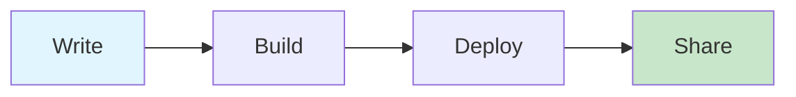

# @knowcode/doc-builder

<div align="center">

> Transform your markdown documentation into beautiful, searchable websites with Notion-inspired styling

[](https://www.npmjs.com/package/@knowcode/doc-builder)
[](https://opensource.org/licenses/MIT)

### 🚀 Quick Start
```bash
npx @knowcode/doc-builder@latest deploy
```

[**Live Demo**](https://doc-builder-delta.vercel.app) | [**NPM Package**](https://www.npmjs.com/package/@knowcode/doc-builder) | [**GitHub**](https://github.com/knowcode/doc-builder)

</div>

---

## ✨ Features

<table>
<tr>
<td width="50%">

### 🎨 Design & UX
- **Notion-inspired UI** - Clean, modern interface
- **Dark mode support** - Automatic theme switching
- **Responsive layout** - Perfect on any device
- **Syntax highlighting** - Beautiful code blocks

### 🔍 Navigation
- **Full-text search** - Find anything instantly
- **Smart navigation** - Hierarchical structure
- **Breadcrumbs** - Always know where you are
- **Keyboard shortcuts** - Navigate like a pro

</td>
<td width="50%">

### 📊 Content Support
- **Mermaid diagrams** - Visual documentation
- **GitHub markdown** - Full GFM support
- **Interactive tooltips** - Document previews
- **Version tracking** - Build metadata

### 🚀 Deployment
- **One-command deploy** - Push to Vercel
- **Static generation** - Fast & secure
- **Custom domains** - Your brand
- **Preview deploys** - Test changes

</td>
</tr>
</table>

## 🎯 Use Cases

<table>
<tr>
<td width="25%">

### Open Source
Beautiful docs for your community

</td>
<td width="25%">

### Technical Teams
Internal docs developers love

</td>
<td width="25%">

### API Docs
Clear, searchable references

</td>
<td width="25%">

### Knowledge Base
Organize team knowledge

</td>
</tr>
</table>

## 🛠️ Simple Workflow

<table>
<tr>
<td width="25%">

### 1️⃣ Initialize
```bash
npx @knowcode/doc-builder init
```
*Create project structure*

</td>
<td width="25%">

### 2️⃣ Write Docs
```markdown
# Getting Started
Welcome to our docs!

## Features
- ✅ Feature one
- ✅ Feature two
```
*Use markdown files*

</td>
<td width="25%">

### 3️⃣ Preview
```bash
npx doc-builder dev
```
*Live development server*

</td>
<td width="25%">

### 4️⃣ Deploy
```bash
npx doc-builder deploy
```
*Push to production*

</td>
</tr>
</table>

## ⚙️ Configuration

<table>
<tr>
<td width="50%">

### Basic Config
```javascript
module.exports = {
  siteName: 'Your Amazing Docs',
  siteDescription: 'Docs developers love',
  docsDir: 'docs',
  outputDir: 'html'
};
```

</td>
<td width="50%">

### Advanced Features
```javascript
features: {
  mermaid: true,      // Diagrams
  darkMode: true,     // Theme toggle
  authentication: true, // Password
  changelog: true     // Auto-generate
}
```

</td>
</tr>
</table>

## 📊 Rich Content Examples

<table>
<tr>
<td width="50%">

### Mermaid Diagrams


</td>
<td width="50%">

### Code with Syntax Highlighting
```javascript
// Beautiful code blocks
const docBuilder = require('@knowcode/doc-builder');

docBuilder.build({
  siteName: 'My Docs',
  features: { darkMode: true }
});
```

</td>
</tr>
</table>

## 🌟 Why Choose doc-builder?

<table>
<tr>
<td width="33%">

### 🚀 Performance
- **Lightning fast** - Static generation
- **SEO optimized** - Search friendly
- **Accessible** - WCAG compliant

</td>
<td width="33%">

### 🛠️ Developer Experience
- **Zero config** - Works instantly
- **Version control** - Git-friendly
- **Open source** - MIT licensed

</td>
<td width="33%">

### 💰 Cost Effective
- **Free hosting** - Vercel free tier
- **No vendor lock-in** - Your content
- **Export anywhere** - Static HTML

</td>
</tr>
</table>

## 🤝 Get Involved

<table>
<tr>
<td width="50%">

### Contributing
We welcome contributions! Check our [contribution guide](https://github.com/knowcode/doc-builder) to get started.

**Ways to help:**
- 🐛 Report bugs
- 💡 Suggest features
- 📝 Improve docs
- 🔧 Submit PRs

</td>
<td width="50%">

### Community
Join our growing community of documentation enthusiasts!

**Connect with us:**
- 📦 [NPM Package](https://www.npmjs.com/package/@knowcode/doc-builder)
- 🐙 [GitHub Repo](https://github.com/knowcode/doc-builder)
- 🌐 [Website](https://knowcode.com)
- 💬 [Discussions](https://github.com/knowcode/doc-builder/discussions)

</td>
</tr>
</table>

---

<div align="center">

### 📝 License: MIT © KnowCode

Built with ❤️ by developers, for developers

[**Get Started**](https://www.npmjs.com/package/@knowcode/doc-builder) | [**View Demo**](https://doc-builder-delta.vercel.app) | [**Star on GitHub**](https://github.com/knowcode/doc-builder)

</div>
