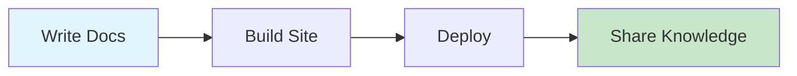

# @knowcode/doc-builder

> Transform your markdown documentation into beautiful, searchable websites with Notion-inspired styling

[](https://www.npmjs.com/package/@knowcode/doc-builder)
[](https://opensource.org/licenses/MIT)

## 🚀 Quick Start

Create stunning documentation sites in minutes:

```bash
# Install globally
npm install -g @knowcode/doc-builder

# Or use with npx
npx @knowcode/doc-builder@latest deploy
```

## ✨ Features

### 🎨 Beautiful Design
- **Notion-inspired UI** - Clean, modern interface that users love
- **Dark mode support** - Automatic theme switching
- **Responsive layout** - Perfect on desktop and mobile
- **Syntax highlighting** - Beautiful code blocks with language support

### 🔍 Powerful Search & Navigation
- **Full-text search** - Find anything instantly
- **Smart navigation** - Hierarchical folder structure
- **Breadcrumbs** - Always know where you are
- **Keyboard shortcuts** - Navigate like a pro

### 📊 Rich Content Support
- **Mermaid diagrams** - Flowcharts, sequence diagrams, and more
- **GitHub-flavored markdown** - Tables, task lists, and strikethrough
- **Interactive tooltips** - Document summaries on hover
- **Version tracking** - Know which version built your docs

### 🚀 Easy Deployment
- **One-command deploy** - Push to Vercel instantly
- **Static site generation** - Fast, secure, and scalable
- **Custom domains** - Your docs, your brand
- **Preview deployments** - Test before going live

## 📖 Documentation

Visit our [official documentation](https://www.npmjs.com/package/@knowcode/doc-builder) for detailed guides and API reference.

## 🎯 Perfect For

- **Open source projects** - Beautiful docs for your community
- **Technical teams** - Internal documentation that developers actually use
- **API documentation** - Clear, searchable API references
- **Knowledge bases** - Organize and share team knowledge

## 🛠️ Simple Workflow

### 1. Initialize Your Project

```bash
npx @knowcode/doc-builder init
```

### 2. Write Your Documentation

Create markdown files in your `docs` folder:

```markdown
# Getting Started

Welcome to our documentation!

## Installation

\`\`\`bash
npm install amazing-package
\`\`\`

## Features

- ✅ Feature one
- ✅ Feature two
- ✅ Feature three
```

### 3. Build & Preview

```bash
# Build your site
npx doc-builder build

# Preview locally
npx doc-builder serve
```

### 4. Deploy to Vercel

```bash
npx doc-builder deploy
```

## 🎨 Customization

Configure your site with `doc-builder.config.js`:

```javascript
module.exports = {
  siteName: 'Your Amazing Docs',
  siteDescription: 'Documentation that developers love',
  features: {
    mermaid: true,
    darkMode: true,
    authentication: false
  }
};
```

## 📊 Mermaid Diagram Support

Create beautiful diagrams in your markdown:



## 🔒 Optional Authentication

Protect sensitive documentation with built-in authentication:

```javascript
features: {
  authentication: true
}
```

## 🌟 Why doc-builder?

- **Zero configuration** - Works out of the box
- **Lightning fast** - Static site generation for instant loading
- **SEO friendly** - Optimized for search engines
- **Accessible** - WCAG compliant
- **Version control** - Track changes with Git
- **Open source** - MIT licensed

## 🤝 Contributing

We welcome contributions! Check out our [contribution guide](https://github.com/knowcode/doc-builder) to get started.

## 📝 License

MIT © KnowCode

---

<div align="center">
  <p>Built with ❤️ by developers, for developers</p>
  <p>
    <a href="https://www.npmjs.com/package/@knowcode/doc-builder">npm</a> •
    <a href="https://github.com/knowcode/doc-builder">GitHub</a> •
    <a href="https://knowcode.com">Website</a>
  </p>
</div>
