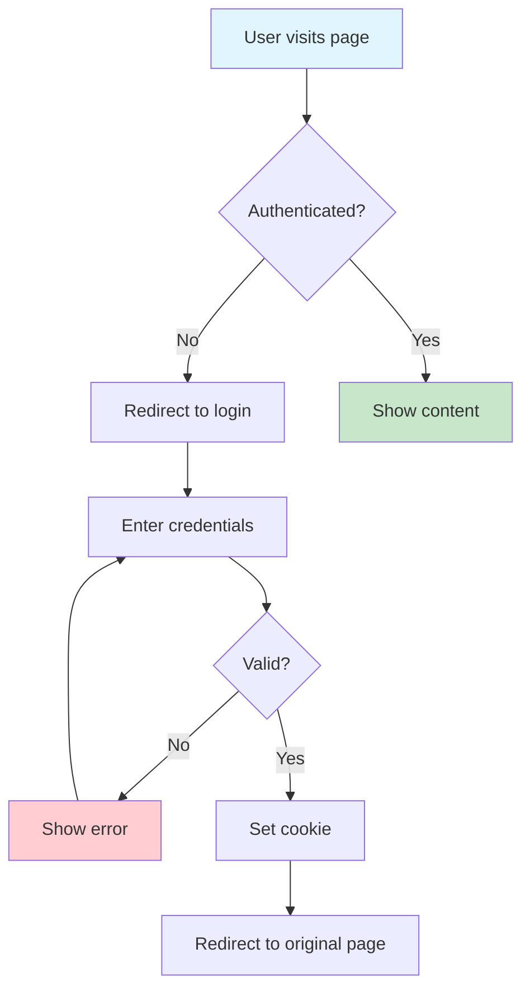

# ⚠️ DEPRECATED: Basic Authentication Guide

> **SECURITY WARNING**: This basic authentication method has been deprecated and removed due to security vulnerabilities. 
> 
> **Use [Supabase Authentication](supabase-auth-setup-guide.md) instead** for secure, enterprise-grade authentication.

# Authentication Guide for @knowcode/doc-builder (DEPRECATED)

## Overview

> 🚨 **This authentication method has been REMOVED in version 2.0.0** due to serious security flaws. Please migrate to [Supabase Authentication](supabase-auth-setup-guide.md).

This guide explains the old, insecure authentication method that was available in @knowcode/doc-builder v1.x. It has been completely removed for security reasons.

## What is Authentication?

The authentication feature in doc-builder provides a simple way to protect your documentation from unauthorized access. When enabled, users must log in with a username and password before viewing any documentation pages.

### Features
- ✅ **Client-side authentication** - Works with static site hosting
- ✅ **Cookie-based sessions** - Users stay logged in across pages
- ✅ **Redirect handling** - Returns users to requested page after login
- ✅ **Logout functionality** - Clear session and return to login
- ✅ **Customizable credentials** - Set your own username/password

### Limitations
- ⚠️ **Basic security** - Suitable for casual protection only
- ⚠️ **Client-side validation** - Not suitable for highly sensitive data
- ⚠️ **Single user** - No multi-user or role-based access
- ⚠️ **Credentials in JavaScript** - Visible in browser developer tools

## How Authentication Works



### Technical Flow

1. **Page Load**: Every page includes `auth.js` which checks for authentication
2. **Cookie Check**: Looks for `doc-auth` cookie with valid token
3. **Redirect**: Unauthenticated users sent to `/login.html`
4. **Login**: Credentials validated client-side against config values
5. **Session**: Base64-encoded token stored in cookie
6. **Access**: Authenticated users can view all pages

## Configuration

### Enable Authentication

Authentication can be enabled in three ways:

#### 1. Configuration File
Create `doc-builder.config.js` in your project root:

```javascript
module.exports = {
  siteName: '@knowcode/doc-builder',
  siteDescription: 'Internal documentation portal',
  
  features: {
    authentication: true
  },
  
  auth: {
    username: 'myusername',
    password: 'mysecurepassword'
  }
};
```

#### 2. Using Presets
Use the notion-inspired preset which has authentication enabled by default:

```bash
npx @knowcode/doc-builder@latest build --preset notion-inspired
```

Default credentials for preset:
- Username: `admin`
- Password: `docs2025`

#### 3. Command Line
Disable authentication for a specific build:

```bash
npx @knowcode/doc-builder@latest build --no-auth
```

### Configuration Options

| Option | Type | Default | Description |
|--------|------|---------|-------------|
| `features.authentication` | boolean | `false` | Enable/disable authentication |
| `auth.username` | string | `'admin'` | Login username |
| `auth.password` | string | `'password'` | Login password |

## Usage

### For Site Administrators

1. **Set Credentials**: Configure username/password in `doc-builder.config.js`
2. **Build Site**: Run `npx @knowcode/doc-builder@latest build`
3. **Deploy**: Upload to your hosting provider
4. **Share Credentials**: Provide login details to authorized users

### For End Users

1. **Visit Site**: Navigate to any documentation page
2. **Login**: Enter username and password on login page
3. **Browse**: Access all documentation pages
4. **Logout**: Click logout link in header (when available)

## Security Considerations

### ⚠️ Important Warnings

1. **Client-Side Only**: Authentication happens in the browser, making it unsuitable for truly sensitive data
2. **Visible Credentials**: Username/password are embedded in JavaScript and visible to anyone who views page source
3. **No Server Validation**: Any user who knows the credentials can access the site
4. **Static Files**: All documentation files are still publicly accessible if URLs are known

### When to Use

✅ **Good for:**
- Internal team documentation
- Preview deployments
- Casual access control
- Preventing search engine indexing
- Client presentations

❌ **Not suitable for:**
- Highly confidential information
- Personal data (GDPR/privacy)
- Financial or legal documents
- Source code or API keys
- Medical records

### Security Best Practices

1. **Use HTTPS**: Always deploy to HTTPS-enabled hosting
2. **Strong Passwords**: Use complex, unique passwords
3. **Regular Updates**: Change credentials periodically
4. **Monitor Access**: Check hosting logs for unusual activity
5. **Consider Alternatives**: For sensitive data, use server-side authentication

## Implementation Details

### Generated Files

When authentication is enabled, doc-builder creates:

1. **login.html** - Login page with form
2. **logout.html** - Logout confirmation page  
3. **auth.js** - Authentication check script (included on all pages)

### Cookie Format

The authentication cookie:
- Name: `doc-auth`
- Value: Base64-encoded `username:password`
- Path: `/` (entire site)
- Expiry: Session (until browser closed)

### Customization

The login/logout pages use the same CSS as your documentation, inheriting your site's theme and styling.

## Troubleshooting

### Common Issues

**Users get logged out frequently**
- Session cookies expire when browser closes
- Consider implementing "remember me" functionality

**Login page shows but credentials don't work**
- Verify credentials in config match exactly (case-sensitive)
- Check browser console for JavaScript errors
- Ensure cookies are enabled

**Some pages accessible without login**
- Verify all HTML pages include auth.js
- Check for direct file access (PDFs, images)
- Ensure no pages exclude authentication script

**Login redirects to wrong page**
- Check redirect parameter handling
- Verify relative vs absolute URLs

### Debug Mode

Check browser developer console for:
- Cookie values
- Redirect URLs  
- JavaScript errors
- Network requests

## Alternatives

For more robust authentication, consider:

1. **Vercel Authentication** - Built-in password protection
2. **Netlify Identity** - User management service
3. **Auth0** - Full authentication platform
4. **Cloudflare Access** - Zero-trust security
5. **Basic Auth** - Server-level protection

## Example Implementation

### Simple Protected Docs

```javascript
// doc-builder.config.js
module.exports = {
  siteName: '@knowcode/doc-builder',
  features: {
    authentication: true
  },
  auth: {
    username: 'team',
    password: 'handbook2025'
  }
};
```

### Build and Deploy

```bash
# Build with authentication
npx @knowcode/doc-builder@latest build

# Deploy to Vercel
npx @knowcode/doc-builder@latest deploy
```

### User Instructions

Email to team:
```
Our documentation is now available at:
https://docs.example.com

Login credentials:
Username: team
Password: handbook2025

Please bookmark the site after logging in.
```

## Conclusion

The authentication feature in @knowcode/doc-builder provides a simple way to add basic access control to your documentation. While not suitable for highly sensitive information, it's perfect for internal docs, client previews, and casual protection needs.

Remember: For production use with sensitive data, always implement proper server-side authentication with your hosting provider.

---

## Document History

| Date | Version | Author | Changes |
|------|---------|--------|---------|
| 2025-07-21 | 1.0 | System | Initial authentication guide |