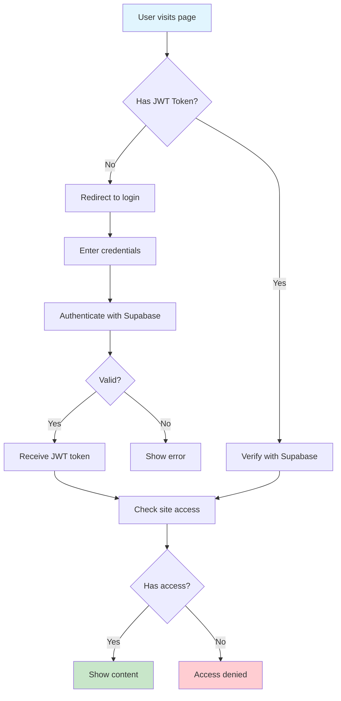

# Authentication Guide for @knowcode/doc-builder

## Overview

@knowcode/doc-builder supports enterprise-grade authentication through **Supabase** - a secure, scalable authentication platform. This guide explains how to protect your documentation with proper user authentication and access control.

## Why Supabase?

- 🔐 **Enterprise Security**: JWT tokens, bcrypt password hashing, Row Level Security
- 👥 **Multi-User Support**: Unlimited users with fine-grained access control
- 🌍 **Scalable**: Built on PostgreSQL, handles millions of users
- 🔄 **Real-time**: Live updates when permissions change
- 💰 **Generous Free Tier**: 50,000 monthly active users free

## How It Works



## Setting Up Authentication

### Step 1: Create Supabase Project

1. Go to [Supabase](https://supabase.com)
2. Create a new project
3. Note your project URL and anon key

### Step 2: Configure doc-builder

Create or update `doc-builder.config.js`:

```javascript
module.exports = {
  siteName: 'My Documentation',
  
  features: {
    authentication: 'supabase'  // Enable Supabase auth
  },
  
  auth: {
    supabaseUrl: 'https://your-project.supabase.co',
    supabaseAnonKey: 'your-anon-key',
    siteId: 'your-site-id'  // From database after setup
  }
};
```

### Step 3: Set Up Database

Run these SQL commands in your Supabase SQL editor:

```sql
-- Create sites table
CREATE TABLE docbuilder_sites (
    id UUID PRIMARY KEY DEFAULT gen_random_uuid(),
    domain TEXT UNIQUE NOT NULL,
    name TEXT NOT NULL,
    created_at TIMESTAMPTZ DEFAULT NOW()
);

-- Create access table
CREATE TABLE docbuilder_access (
    id UUID PRIMARY KEY DEFAULT gen_random_uuid(),
    user_id UUID NOT NULL REFERENCES auth.users(id),
    site_id UUID NOT NULL REFERENCES docbuilder_sites(id),
    created_at TIMESTAMPTZ DEFAULT NOW(),
    UNIQUE(user_id, site_id)
);

-- Enable Row Level Security
ALTER TABLE docbuilder_sites ENABLE ROW LEVEL SECURITY;
ALTER TABLE docbuilder_access ENABLE ROW LEVEL SECURITY;

-- Create policies
CREATE POLICY "Sites visible to users with access" ON docbuilder_sites
    FOR SELECT USING (
        id IN (
            SELECT site_id FROM docbuilder_access 
            WHERE user_id = auth.uid()
        )
    );

CREATE POLICY "Access visible to own user" ON docbuilder_access
    FOR SELECT USING (user_id = auth.uid());
```

### Step 4: Add Your Site

```sql
INSERT INTO docbuilder_sites (domain, name)
VALUES ('your-domain.com', 'Your Documentation Name');
```

Note the returned ID - this is your `siteId` for the config.

### Step 5: Create Users

Users can sign up through Supabase Auth, or you can create them:

```sql
-- In Supabase dashboard, go to Authentication > Users
-- Click "Invite user" and enter their email
```

### Step 6: Grant Access

```sql
-- Grant user access to your site
INSERT INTO docbuilder_access (user_id, site_id)
VALUES (
    (SELECT id FROM auth.users WHERE email = 'user@example.com'),
    'your-site-id'
);
```

## Deployment

### Build with Authentication

```bash
# Build with auth enabled (reads from config)
npx @knowcode/doc-builder build

# Build without auth (override config)
npx @knowcode/doc-builder build --no-auth
```

### Deploy to Vercel

```bash
# Deploy with auth
npx @knowcode/doc-builder deploy

# Deploy public site
npx @knowcode/doc-builder deploy --no-auth
```

## User Management

### CLI Commands (Future)

```bash
# Add user to site
npx @knowcode/doc-builder auth:grant --email user@example.com --site-id xxx

# Remove user access
npx @knowcode/doc-builder auth:revoke --email user@example.com --site-id xxx

# List users with access
npx @knowcode/doc-builder auth:list-users --site-id xxx
```

### Manual Management

Use Supabase dashboard or SQL commands to manage users and access.

## Security Features

### What Supabase Provides

- ✅ **JWT Authentication**: Industry-standard secure tokens
- ✅ **Password Hashing**: bcrypt with salt
- ✅ **Row Level Security**: Database-level access control
- ✅ **Session Management**: Automatic token refresh
- ✅ **Multi-Factor Auth**: Optional 2FA support
- ✅ **OAuth Providers**: Google, GitHub, etc. (optional)

### Security Best Practices

1. **Use environment variables** for sensitive config:
   ```javascript
   auth: {
     supabaseUrl: process.env.SUPABASE_URL,
     supabaseAnonKey: process.env.SUPABASE_ANON_KEY,
     siteId: process.env.DOC_SITE_ID
   }
   ```

2. **Enable RLS policies** on all tables
3. **Regular access audits** - review who has access
4. **Use custom domains** for professional appearance
5. **Monitor usage** in Supabase dashboard

## Troubleshooting

### Common Issues

**Users can't log in**
- Verify Supabase project is active
- Check credentials are correct
- Ensure user exists in auth.users
- Verify site domain matches configuration

**Content flashes before redirect**
- This is fixed in latest versions
- Ensure you're using @knowcode/doc-builder v1.7.4+

**Access denied after login**
- Check user has entry in docbuilder_access table
- Verify site_id matches your configuration
- Check RLS policies are correctly set up

### Debug Checklist

1. Check browser console for errors
2. Verify JWT token in browser DevTools > Application > Storage
3. Test Supabase connection separately
4. Check network tab for API calls
5. Verify domain in database matches deployment

## Migration from Old Auth

If you were using the old authentication system:

1. **Remove old config**:
   ```javascript
   // Remove this:
   auth: {
     username: 'admin',
     password: 'password'
   }
   ```

2. **Set up Supabase** following this guide

3. **Update config** to use Supabase:
   ```javascript
   features: {
     authentication: 'supabase'
   }
   ```

## Conclusion

Supabase authentication provides enterprise-grade security for your documentation while maintaining ease of use. With proper setup, you get secure, scalable authentication that grows with your needs.

For public documentation that doesn't need authentication, simply set `authentication: false` or use the `--no-auth` flag during build/deploy.