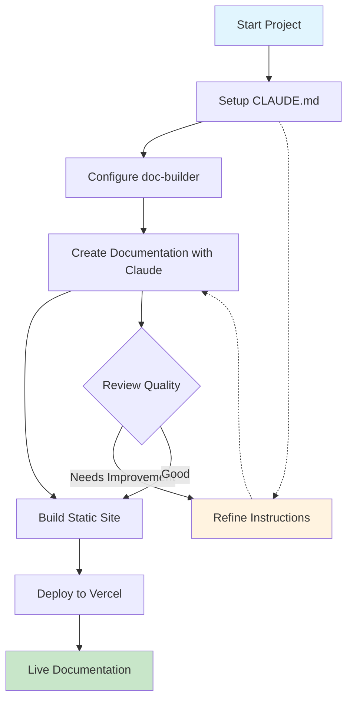
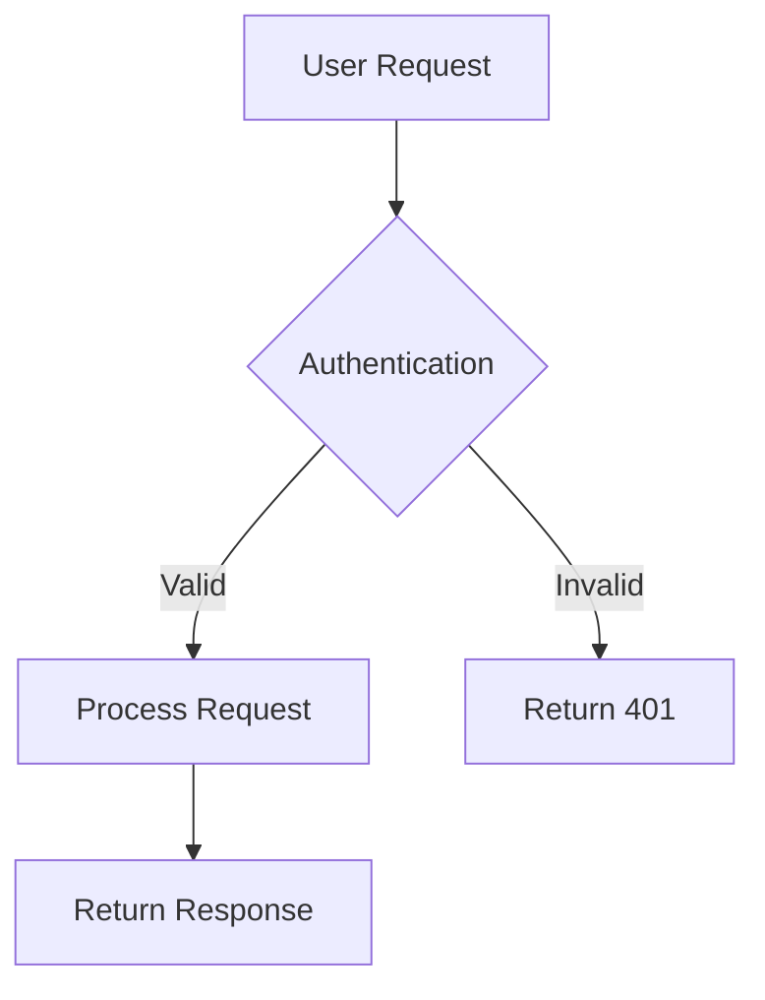
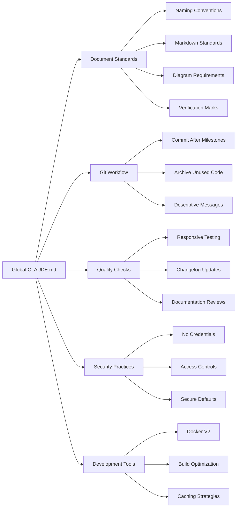
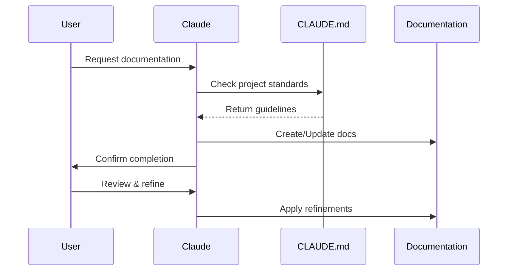
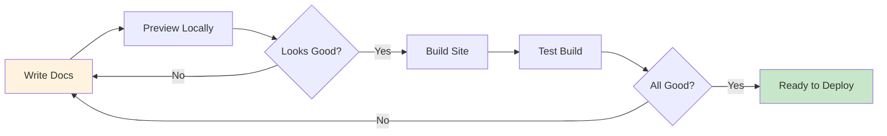
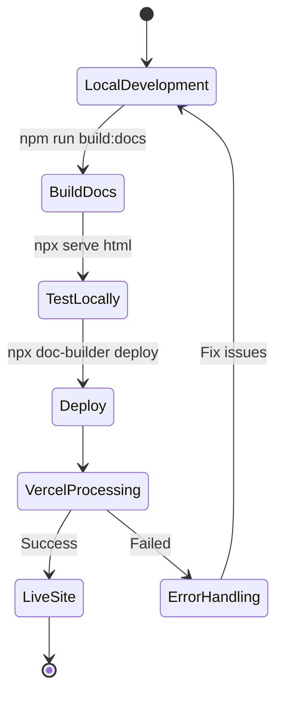
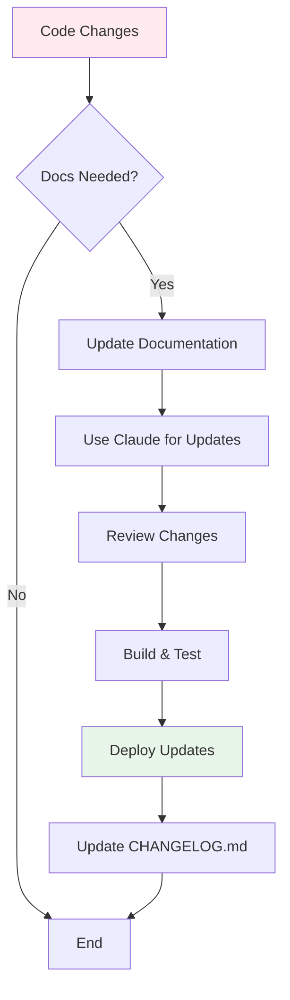

# Claude + CLAUDE.md Documentation Workflow Guide

**Generated**: 2025-07-21 10:00 UTC  
**Status**: Complete  
**Verified**: ✅

## Overview

This guide demonstrates an efficient workflow for using Claude Code with a refined CLAUDE.md file to create high-quality documentation and deploy it to Vercel using the @knowcode/doc-builder tool.

## Workflow Overview



## Step 1: Setting Up CLAUDE.md

### 1.1 Project-Level CLAUDE.md

Create a comprehensive `CLAUDE.md` file in your project root with specific instructions for documentation. Here's a complete example based on best practices:

```markdown
# CLAUDE.md - [Your Project Name]

This file provides comprehensive guidance for Claude Code when working in this project.

## Project Overview

**Name**: Your Project  
**Purpose**: Brief description of what your project does  
**Technology Stack**: List your key technologies (e.g., Node.js, React, AWS)

## Documentation Standards

### Document Title Format
- Use `# Document Title`
- Include metadata:
  - **Generated**: YYYY-MM-DD HH:MM UTC
  - **Status**: Draft/In Progress/Complete
  - **Verified**: ✅ (for verified information) / ❓ (for speculated information)

### Document Structure
- All documentation goes in the `/docs` directory
- Use hierarchical folder structure:
  - `docs/guides/` - How-to guides and tutorials
  - `docs/api/` - API reference documentation
  - `docs/architecture/` - System design and architecture
  - `docs/deployment/` - Deployment and operations guides
  - `docs/troubleshooting/` - Common issues and solutions

### Naming Conventions
- Analysis documents: `analysis-{topic}-{specifics}.md`
- Design documents: `design-{component}-{feature}.md`
- Implementation plans: `plan-{feature}-implementation.md`
- Technical guides: `{component}-{topic}-guide.md`
- API docs: `api-{service}-reference.md`
- Testing documents: `test-{component}-{type}.md`

### Content Requirements

#### 1. Mermaid Diagrams
- Include diagrams wherever they help explain complex concepts
- Use consistent node naming and styling
- Add clear labels and descriptions
- Example:


#### 2. Information Verification
- Mark all information as either verified (✅) or speculated (❓)
- Include sources for verified information
- Clearly indicate assumptions
- Example:
  - ✅ This API endpoint requires authentication (verified in auth.js:45)
  - ❓ Response time should be under 200ms (performance requirement assumed)

#### 3. Code Examples
- Use proper syntax highlighting with language identifiers
- Include context and explanations
- Show both correct and incorrect usage where applicable
- Add error handling in examples
- Example:
```javascript
// ✅ Correct way to call the API
try {
  const response = await api.getData({ userId: 123 });
  console.log('Data:', response.data);
} catch (error) {
  console.error('API Error:', error.message);
}

// ❌ Incorrect - missing error handling
const response = await api.getData({ userId: 123 });
```

#### 4. Practical Examples
- Include real-world scenarios
- Show complete workflows
- Add curl/httpie examples for APIs
- Include sample data

### Writing Style
- Use clear, concise language
- Write for your audience's technical level
- Use active voice
- Keep paragraphs short (3-4 sentences)
- Use bullet points for lists
- Bold important terms on first use

### Standard Sections

Every technical document should include:

1. **Overview** - Brief description of the topic
2. **Prerequisites** - What the reader needs to know/have
3. **Main Content** - The core information
4. **Examples** - Practical demonstrations
5. **Troubleshooting** - Common issues and solutions
6. **References** - Links to related documentation

### Tables and Structured Data

Use tables for comparing options or listing properties:

| Property | Type | Required | Description |
|----------|------|----------|-------------|
| id | string | Yes | Unique identifier |
| name | string | Yes | Display name |
| active | boolean | No | Whether the item is active |

### File Organization
- Active files in appropriate directories
- Move unused files to `archive/` with descriptive names
- Temporary files must include "temp" in filename
- Example structure:
  ```
  docs/
  ├── guides/
  │   ├── setup-guide.md
  │   └── deployment-guide.md
  ├── api/
  │   └── rest-api-reference.md
  └── archive/
      └── old-setup-guide-2024.md
  ```

## Git and Version Control

### Commit Practices
- Commit after material changes or milestones
- Use descriptive commit messages
- Group related changes
- Format: `type: Brief description`
- Types: feat, fix, docs, style, refactor, test, chore

### Documentation Updates
- Update documentation when code changes
- Keep CHANGELOG.md current
- Document breaking changes prominently

## Quality Standards

### Completeness
- Cover all aspects of the topic
- Include edge cases
- Document error scenarios
- Add performance considerations

### Accuracy
- Verify technical details
- Test all code examples
- Review with subject matter experts
- Update when implementation changes

### Maintenance
- Review documentation quarterly
- Update version numbers
- Check for broken links
- Verify code examples still work

## Special Considerations

### Security
- Never include credentials or sensitive data
- Document security requirements
- Include authentication examples without real tokens
- Note security best practices

### Performance
- Document performance implications
- Include benchmarks where relevant
- Note resource requirements
- Add optimization tips

### Accessibility
- Use semantic markdown
- Include alt text for images
- Ensure good heading hierarchy
- Write clear link text (not "click here")

## AI-Specific Instructions

When generating documentation:

1. **Always include the metadata header** with generation date and verification status
2. **Create working examples** that can be copy-pasted
3. **Add troubleshooting sections** for common problems
4. **Include mermaid diagrams** for workflows and architectures
5. **Mark speculated information** clearly with ❓
6. **Follow the naming conventions** exactly
7. **Create comprehensive content** - aim for completeness over brevity
8. **Add cross-references** to related documentation

## Project-Specific Patterns

[Add your project-specific patterns here, such as:]
- API authentication flow
- Database connection patterns
- Error handling conventions
- Logging standards
- Testing approaches

## Common Code Snippets

[Add frequently used code patterns for consistency:]
```javascript
// Standard error handling pattern
function handleError(error) {
  logger.error('Operation failed:', {
    message: error.message,
    stack: error.stack,
    timestamp: new Date().toISOString()
  });
  // ... rest of error handling
}
```

## References

- [Project README](/README.md)
- [API Documentation](/docs/api/)
- [Architecture Overview](/docs/architecture/)
- [Contributing Guide](/CONTRIBUTING.md)
```

### 1.2 Global CLAUDE.md Best Practices

Your global `~/.claude/CLAUDE.md` should include universal standards that apply to all projects. Here's an expanded example:

```markdown
# Global CLAUDE.md Instructions

## Universal Documentation Standards

### Visual Elements
- Where it makes sense, include diagrams (Mermaid preferred)
- Use skeleton loaders for UI components
- For Trello board screenshots:
  - Save as: @docs/product-requirements/Screenshot YYYY-MM-DD at HH.MM.SS.png
  - Ensure columns are top-justified
  - Color-code columns by risk level

### Information Verification
- Mark all verified vs. speculated information as a general document standard
- Use ✅ for verified information with source references
- Use ❓ for assumptions or unverified information

### Development Practices
- Use Docker V2 for containerization
- Name temporary test files with "temp" in the filename
- Do git commits after material changes or milestones
- Archive unused files by moving to archive/ and renaming
- After debugging, suggest archiving old unused code

### Directory Organization
- Create all new markdown docs in the /docs directory
- Put documents in relevant subdirectories
- MD docs will always go under the /docs directory
- Maintain clear folder hierarchies

### Build and Deployment
- Carefully manage container sizes to prevent bloat
- Use multi-stage builds for Docker
- Remove unnecessary dependencies during build
- Leverage .dockerignore effectively
- Consider Alpine or slim base images
- Be cautious with npx vs npm caching issues

### Documentation Maintenance
- Always maintain a CHANGELOG.md for significant changes
- Check responsive breakpoints for consistency
- Use table approach for columns in MD files when appropriate

### Vercel-Specific
- For public access, disable project/deployment protection in Vercel console
- Remember to disable Vercel authentication for public projects

### Git Workflow
- Commit after every big milestone or completed major task
- Use descriptive commit messages
- Group related changes in single commits
```



## Step 2: Initialize doc-builder

```bash
# Install doc-builder
npm install -D @knowcode/doc-builder

# Initialize configuration
npx doc-builder init
```

### 2.1 Configure doc-builder.config.js

```javascript
module.exports = {
  siteName: 'Your Project Documentation',
  siteDescription: 'Comprehensive documentation for Your Project',
  docsDir: 'docs',
  outputDir: 'html',
  features: {
    authentication: false,  // Set true for private docs
    changelog: true,
    mermaid: true,
    darkMode: true
  }
};
```

## Step 3: Documentation Creation Workflow with Claude

### 3.1 Effective Prompting Strategy



### 3.2 Example Documentation Requests

#### Initial Architecture Documentation
```
"Create comprehensive architecture documentation for our authentication system. Include:
- System overview with mermaid diagrams
- Component interactions
- API endpoints
- Security considerations
- Deployment architecture"
```

#### API Documentation
```
"Document all REST API endpoints in our user service. For each endpoint include:
- HTTP method and path
- Request/response schemas
- Authentication requirements
- Example requests with curl
- Error responses"
```

#### Setup Guide
```
"Create a detailed setup guide for new developers including:
- Prerequisites
- Environment setup steps
- Configuration options
- Common issues and solutions
- Development workflow"
```

### 3.3 Claude Interaction Best Practices

1. **Be Specific**: Provide clear requirements and expected structure
2. **Iterate**: Review generated content and request refinements
3. **Verify**: Ask Claude to mark verified vs speculated information
4. **Examples**: Request concrete examples and code snippets
5. **Diagrams**: Explicitly request mermaid diagrams for visual clarity

## Step 4: Building Documentation Site

### 4.1 Development Workflow



### 4.2 Commands

```bash
# Start development server
npm run dev:docs

# Build static site
npm run build:docs

# Preview built site
npx serve html
```

## Step 5: Deploying to Vercel

### 5.1 First-Time Setup

```bash
# Deploy to Vercel (interactive)
npx doc-builder deploy

# Or with npm script
npm run deploy:docs
```

### 5.2 Vercel Configuration

The tool automatically creates `vercel.json`:

```json
{
  "outputDirectory": "html",
  "routes": [
    {
      "src": "/(.*)",
      "dest": "/$1"
    }
  ]
}
```

### 5.3 Deployment Workflow



## Step 6: Continuous Documentation Updates

### 6.1 Update Workflow



### 6.2 Maintaining Documentation Quality

1. **Regular Reviews**: Schedule periodic documentation reviews
2. **Automated Checks**: Add documentation linting to CI/CD
3. **User Feedback**: Create feedback mechanism for documentation
4. **Version Tracking**: Maintain documentation versions with code versions

## Advanced CLAUDE.md Refinements

### 7.1 Project-Specific Instructions

```markdown
## Project-Specific Documentation Rules

### Component Documentation
- Each major component needs its own guide
- Include architecture decisions
- Document integration points
- Add performance considerations
- Note dependencies and version requirements

### Code Examples
- Use the project's primary language (e.g., TypeScript, JavaScript)
- Include error handling in all examples
- Show both correct and incorrect usage
- Add inline comments for clarity
- Test all examples before including
- Include import statements

### API Documentation
- Document all public endpoints
- Include authentication requirements
- Show request/response examples
- Document rate limits
- Include error response codes
- Add curl examples for testing

### Diagrams
- Use mermaid for all flow diagrams
- Include sequence diagrams for APIs
- Add state diagrams for complex logic
- Create entity relationship diagrams for data models
- Use consistent styling and colors
- Add titles to all diagrams

### Testing Documentation
- Document test setup requirements
- Include example test cases
- Show how to run specific test suites
- Document mocking strategies
- Include performance benchmarks

### Deployment Documentation
- Include environment-specific configurations
- Document secret management
- Show deployment commands
- Include rollback procedures
- Document monitoring setup
```

### 7.2 Documentation Templates

Create templates in your CLAUDE.md:

```markdown
## Documentation Templates

### API Endpoint Template
```
## [HTTP Method] /api/[endpoint]

**Purpose**: [Brief description]

### Request
- **Headers**: 
  - `Authorization: Bearer [token]`
  - `Content-Type: application/json`
- **Body**:
  ```json
  {
    "field": "value"
  }
  ```

### Response
- **Success (200)**:
  ```json
  {
    "data": {}
  }
  ```
- **Error (4xx/5xx)**:
  ```json
  {
    "error": "Description"
  }
  ```

### Examples
```bash
curl -X POST https://api.example.com/endpoint \
  -H "Authorization: Bearer token" \
  -d '{"field": "value"}'
```
```

## Best Practices Summary

### Documentation Creation
1. ✅ Use CLAUDE.md to maintain consistency across all documentation
2. ✅ Include visual diagrams (Mermaid) for complex concepts and workflows
3. ✅ Provide practical, working examples that can be copy-pasted
4. ✅ Mark verification status (✅/❓) for all technical information
5. ✅ Keep documentation close to code in the /docs directory
6. ✅ Include metadata headers with timestamps and status
7. ✅ Add troubleshooting sections for common issues
8. ✅ Cross-reference related documentation

### Claude Interaction
1. ✅ Provide clear, specific requests with expected output format
2. ✅ Reference existing patterns from CLAUDE.md
3. ✅ Request iterative improvements - review and refine
4. ✅ Verify technical accuracy of generated content
5. ✅ Ask for troubleshooting sections explicitly
6. ✅ Request examples with error handling
7. ✅ Specify diagram types needed (sequence, flow, state)
8. ✅ Ask Claude to check its own work against CLAUDE.md standards

### Documentation Maintenance
1. ✅ Update docs when code changes
2. ✅ Archive outdated documentation
3. ✅ Maintain CHANGELOG.md
4. ✅ Review documentation quarterly
5. ✅ Test all code examples
6. ✅ Check for broken links
7. ✅ Update version references

### Deployment
1. ✅ Test locally before deploying (npm run dev:docs)
2. ✅ Build and verify output (npm run build:docs)
3. ✅ Use preview deployments first
4. ✅ Configure custom domains if needed
5. ✅ Enable HTTPS (automatic with Vercel)
6. ✅ Monitor deployment health
7. ✅ Disable Vercel authentication for public docs
8. ✅ Commit documentation changes before deploying

## Common Issues and Solutions

### Issue 1: Claude Not Following Standards
**Solution**: Refine CLAUDE.md with more specific examples and explicit requirements

### Issue 2: Documentation Build Fails
**Solution**: Check markdown syntax, ensure all links are valid, verify mermaid syntax

### Issue 3: Vercel Deployment Issues
**Solution**: Check vercel.json configuration, ensure output directory is correct

### Issue 4: Navigation Not Generated
**Solution**: Verify folder structure follows conventions, check for special characters in filenames

## Conclusion

This workflow enables efficient, high-quality documentation creation by:
- Leveraging Claude's capabilities with clear guidelines
- Using doc-builder for beautiful, searchable output
- Deploying seamlessly to Vercel for instant access
- Maintaining consistency through CLAUDE.md refinements

The key to success is iterative refinement of your CLAUDE.md file to capture your team's specific documentation needs and standards.

## Document History

| Date | Author | Changes |
|------|--------|---------|
| 2025-07-21 | Claude | Initial creation |