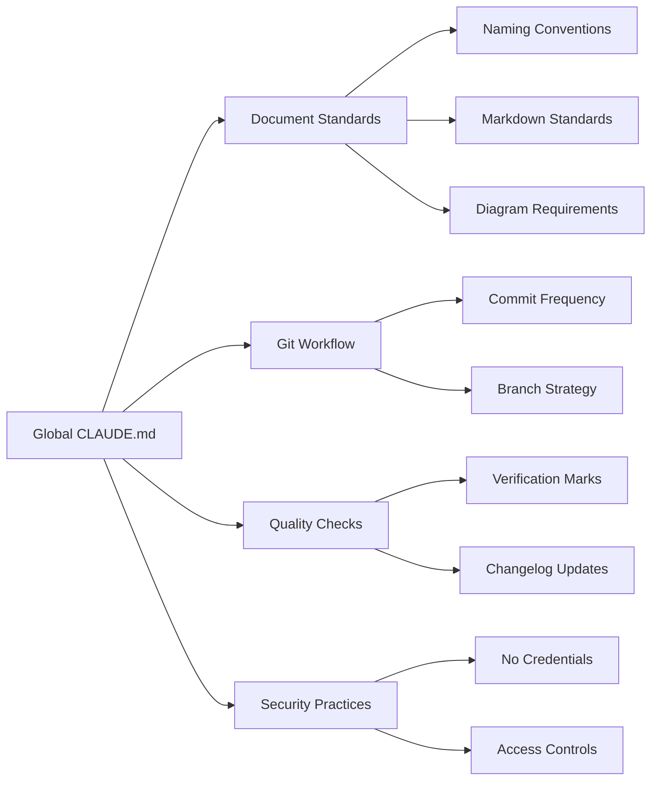

# Claude + CLAUDE.md Documentation Workflow Guide

**Generated**: 2025-07-21 10:00 UTC  
**Status**: Complete  
**Verified**: ✅

## Overview

This guide demonstrates an efficient workflow for using Claude Code with a refined CLAUDE.md file to create high-quality documentation and deploy it to Vercel using the @knowcode/doc-builder tool.

## Workflow Overview


## Step 1: Setting Up CLAUDE.md

### 1.1 Project-Level CLAUDE.md

Create a `CLAUDE.md` file in your project root with specific instructions for documentation:

```markdown
# CLAUDE.md - [Your Project Name]

## Documentation Standards

### Document Structure
- All documentation goes in the `/docs` directory
- Use hierarchical folder structure for organization
- Follow naming convention: `{component}-{topic}-guide.md`

### Content Requirements
- Include mermaid diagrams for complex workflows
- Mark verified (✅) vs speculated (❓) information
- Add timestamps to all documents
- Include practical examples

### Writing Style
- Use clear, concise language
- Target intermediate technical audience
- Include code examples with syntax highlighting
- Add troubleshooting sections

### Metadata Format
```
**Generated**: YYYY-MM-DD HH:MM UTC
**Status**: Draft/Complete
**Verified**: ✅/❓
```
```

### 1.2 Global CLAUDE.md Best Practices

Your global `~/.claude/CLAUDE.md` should include:



## Step 2: Initialize doc-builder

```bash
# Install doc-builder
npm install -D @knowcode/doc-builder

# Initialize configuration
npx doc-builder init
```

### 2.1 Configure doc-builder.config.js

```javascript
module.exports = {
  siteName: 'Your Project Documentation',
  siteDescription: 'Comprehensive documentation for Your Project',
  docsDir: 'docs',
  outputDir: 'html',
  features: {
    authentication: false,  // Set true for private docs
    changelog: true,
    mermaid: true,
    darkMode: true
  }
};
```

## Step 3: Documentation Creation Workflow with Claude

### 3.1 Effective Prompting Strategy


### 3.2 Example Documentation Requests

#### Initial Architecture Documentation
```
"Create comprehensive architecture documentation for our authentication system. Include:
- System overview with mermaid diagrams
- Component interactions
- API endpoints
- Security considerations
- Deployment architecture"
```

#### API Documentation
```
"Document all REST API endpoints in our user service. For each endpoint include:
- HTTP method and path
- Request/response schemas
- Authentication requirements
- Example requests with curl
- Error responses"
```

#### Setup Guide
```
"Create a detailed setup guide for new developers including:
- Prerequisites
- Environment setup steps
- Configuration options
- Common issues and solutions
- Development workflow"
```

### 3.3 Claude Interaction Best Practices

1. **Be Specific**: Provide clear requirements and expected structure
2. **Iterate**: Review generated content and request refinements
3. **Verify**: Ask Claude to mark verified vs speculated information
4. **Examples**: Request concrete examples and code snippets
5. **Diagrams**: Explicitly request mermaid diagrams for visual clarity

## Step 4: Building Documentation Site

### 4.1 Development Workflow


### 4.2 Commands

```bash
# Start development server
npm run dev:docs

# Build static site
npm run build:docs

# Preview built site
npx serve html
```

## Step 5: Deploying to Vercel

### 5.1 First-Time Setup

```bash
# Deploy to Vercel (interactive)
npx doc-builder deploy

# Or with npm script
npm run deploy:docs
```

### 5.2 Vercel Configuration

The tool automatically creates `vercel.json`:

```json
{
  "outputDirectory": "html",
  "routes": [
    {
      "src": "/(.*)",
      "dest": "/$1"
    }
  ]
}
```

### 5.3 Deployment Workflow


## Step 6: Continuous Documentation Updates

### 6.1 Update Workflow


### 6.2 Maintaining Documentation Quality

1. **Regular Reviews**: Schedule periodic documentation reviews
2. **Automated Checks**: Add documentation linting to CI/CD
3. **User Feedback**: Create feedback mechanism for documentation
4. **Version Tracking**: Maintain documentation versions with code versions

## Advanced CLAUDE.md Refinements

### 7.1 Project-Specific Instructions

```markdown
## Project-Specific Documentation Rules

### Component Documentation
- Each major component needs its own guide
- Include architecture decisions
- Document integration points
- Add performance considerations

### Code Examples
- Use TypeScript for all examples
- Include error handling
- Show both correct and incorrect usage
- Add inline comments for clarity

### Diagrams
- Use mermaid for all flow diagrams
- Include sequence diagrams for APIs
- Add state diagrams for complex logic
- Create entity relationship diagrams for data models
```

### 7.2 Documentation Templates

Create templates in your CLAUDE.md:

```markdown
## Documentation Templates

### API Endpoint Template
```
## [HTTP Method] /api/[endpoint]

**Purpose**: [Brief description]

### Request
- **Headers**: 
  - `Authorization: Bearer [token]`
  - `Content-Type: application/json`
- **Body**:
  ```json
  {
    "field": "value"
  }
  ```

### Response
- **Success (200)**:
  ```json
  {
    "data": {}
  }
  ```
- **Error (4xx/5xx)**:
  ```json
  {
    "error": "Description"
  }
  ```

### Examples
```bash
curl -X POST https://api.example.com/endpoint \
  -H "Authorization: Bearer token" \
  -d '{"field": "value"}'
```
```

## Best Practices Summary

### Documentation Creation
1. ✅ Use CLAUDE.md to maintain consistency
2. ✅ Include visual diagrams for complex concepts
3. ✅ Provide practical examples
4. ✅ Mark verification status
5. ✅ Keep documentation close to code

### Claude Interaction
1. ✅ Provide clear, specific requests
2. ✅ Reference existing patterns
3. ✅ Request iterative improvements
4. ✅ Verify technical accuracy
5. ✅ Ask for troubleshooting sections

### Deployment
1. ✅ Test locally before deploying
2. ✅ Use preview deployments first
3. ✅ Configure custom domains
4. ✅ Enable HTTPS
5. ✅ Monitor deployment health

## Common Issues and Solutions

### Issue 1: Claude Not Following Standards
**Solution**: Refine CLAUDE.md with more specific examples and explicit requirements

### Issue 2: Documentation Build Fails
**Solution**: Check markdown syntax, ensure all links are valid, verify mermaid syntax

### Issue 3: Vercel Deployment Issues
**Solution**: Check vercel.json configuration, ensure output directory is correct

### Issue 4: Navigation Not Generated
**Solution**: Verify folder structure follows conventions, check for special characters in filenames

## Conclusion

This workflow enables efficient, high-quality documentation creation by:
- Leveraging Claude's capabilities with clear guidelines
- Using doc-builder for beautiful, searchable output
- Deploying seamlessly to Vercel for instant access
- Maintaining consistency through CLAUDE.md refinements

The key to success is iterative refinement of your CLAUDE.md file to capture your team's specific documentation needs and standards.

## Document History

| Date | Author | Changes |
|------|--------|---------|
| 2025-07-21 | Claude | Initial creation |