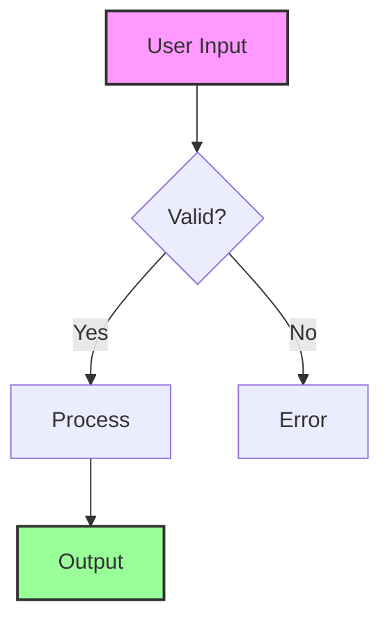

# Document Standards for @knowcode/doc-builder

**Generated**: 2025-07-21 18:00 UTC  
**Status**: Complete  
**Verified**: ✅

## Overview

This document defines the documentation standards and conventions for the @knowcode/doc-builder project. All documentation created for or by this project should follow these guidelines to ensure consistency, clarity, and maintainability.

## Document Structure Standards

### Document Header Format

Every document MUST include the following metadata at the top:

```markdown
# Document Title

**Generated**: YYYY-MM-DD HH:MM UTC
**Status**: Draft/In Progress/Complete  
**Verified**: ✅ (for verified information) / ❓ (for speculated information)

## Overview

Brief description of the document's contents and purpose.
```

### Section Organization

1. **Title** (H1) - Single, descriptive title
2. **Metadata** - Generation date, status, verification
3. **Overview** - Brief summary of document purpose
4. **Main Content** - Organized with clear headings
5. **Document History** - Track significant changes

## Naming Conventions

### Document File Names

Use lowercase with hyphens, following these patterns:

- **Feature Documentation**: `feature-{name}-guide.md`
- **API Documentation**: `api-{endpoint}-reference.md`
- **Technical Guides**: `{component}-{topic}-guide.md`
- **Architecture Documents**: `architecture-{system}-overview.md`
- **Implementation Plans**: `plan-{feature}-implementation.md`
- **Analysis Documents**: `analysis-{topic}-{specifics}.md`
- **Troubleshooting Guides**: `troubleshoot-{issue}-guide.md`
- **Change Logs**: `CHANGELOG.md` (always uppercase)

### Special Files

- `README.md` - Project overview and getting started
- `CHANGELOG.md` - Version history following Keep a Changelog format
- `CLAUDE.md` - AI assistant guidance (project-specific)
- `DOCUMENT-STANDARDS.md` - This file

## Content Standards

### 1. Mermaid Diagrams

Include diagrams wherever they help explain complex concepts:

```markdown

```

Guidelines:
- Use consistent node naming
- Add clear labels and descriptions
- Apply styling for better visual hierarchy
- Include diagram titles where appropriate

### 2. Information Verification

Mark all information with verification status:

- ✅ **Verified**: Information confirmed through testing or official sources
- ❓ **Speculated**: Assumptions or unconfirmed information
- ⚠️ **Warning**: Important caveats or potential issues
- 🚧 **In Progress**: Features or documentation under development

Example:
```markdown
### Feature Status
- ✅ **Markdown parsing**: Fully implemented and tested
- ❓ **Performance impact**: Estimated 100ms for 50 files
- ⚠️ **Large files**: May timeout on files > 10MB
- 🚧 **Search feature**: Currently in development
```

### 3. Code Examples

Always include practical, tested examples:

```javascript
// Good example - with context and error handling
const { build } = require('@knowcode/doc-builder');

const config = {
  siteName: 'My Documentation',
  docsDir: './docs',
  outputDir: './dist'
};

try {
  await build(config);
  console.log('✅ Build successful');
} catch (error) {
  console.error('❌ Build failed:', error.message);
}
```

Guidelines:
- Use syntax highlighting
- Include error handling
- Add helpful comments
- Show both correct and incorrect usage
- Test all examples before documenting

### 4. Command Examples

Format commands clearly with descriptions:

```bash
# Install the package
npm install -D @knowcode/doc-builder

# Build documentation
npx doc-builder build

# Start development server
npx doc-builder dev --port 3000

# Deploy to Vercel
npx doc-builder deploy --prod
```

## Version Control Standards

### Changelog Management

ALWAYS maintain `CHANGELOG.md` for all significant or material changes:

```markdown
## [1.4.12] - 2025-07-21

### Fixed
- Fixed h1 title alignment to extend full width
- Added negative margins to counteract padding

### Background
- The h1 was appearing offset due to content padding
- Now extends full width for better hierarchy
```

Categories:
- **Added** - New features
- **Changed** - Changes to existing functionality
- **Deprecated** - Soon-to-be removed features
- **Removed** - Removed features
- **Fixed** - Bug fixes
- **Security** - Security fixes
- **Background** - Context for the changes

### Commit Messages

Follow conventional commits:
- `feat:` New features
- `fix:` Bug fixes
- `docs:` Documentation changes
- `chore:` Maintenance tasks
- `refactor:` Code refactoring
- `test:` Test additions/changes

## Markdown Best Practices

### Headers

```markdown
# Main Title (H1 - one per document)

## Major Section (H2)

### Subsection (H3)

#### Detail Level (H4)
```

- Use hierarchical structure
- Don't skip levels
- Keep headers concise but descriptive

### Lists

Unordered lists for non-sequential items:
```markdown
- First item
- Second item
  - Nested item
  - Another nested item
- Third item
```

Numbered lists for sequential steps:
```markdown
1. First step
2. Second step
3. Third step
```

### Tables

Keep tables readable and well-formatted:

```markdown
| Feature | Status | Version | Notes |
|---------|--------|---------|-------|
| Mermaid | ✅ Ready | 1.0.0 | Full support |
| Search | 🚧 WIP | 1.5.0 | In development |
| Auth | ✅ Ready | 1.3.0 | Optional feature |
```

### Links

- Use descriptive link text: `[View deployment guide](./deploy.md)`
- Avoid: `[click here](./deploy.md)`
- Prefer relative links for internal docs
- Use absolute URLs for external resources

## Quality Standards

### Clarity

- Write for your target audience
- Define technical terms on first use
- Use simple language where possible
- Include examples for complex concepts

### Completeness

- Cover all aspects of the topic
- Include edge cases and limitations
- Document prerequisites
- Provide troubleshooting guidance

### Accuracy

- Verify all technical details
- Test code examples
- Update when implementation changes
- Mark speculation clearly

### Consistency

- Use same terminology throughout
- Follow naming conventions
- Maintain style consistency
- Cross-reference related documents

## Document Types

### 1. Feature Documentation

Structure:
```markdown
# Feature Name

**Generated**: [date]
**Status**: Complete
**Verified**: ✅

## Overview
What the feature does and why it exists

## Usage
How to use the feature with examples

## Configuration
Available options and settings

## Examples
Practical use cases

## Troubleshooting
Common issues and solutions
```

### 2. Technical Guides

Structure:
```markdown
# Technical Guide: [Topic]

**Generated**: [date]
**Status**: Complete
**Verified**: ✅

## Overview
Technical context and goals

## Architecture
System design and components

## Implementation
Step-by-step technical details

## Testing
How to verify functionality

## Performance
Benchmarks and optimization
```

### 3. API Documentation

Structure:
```markdown
# API: [Endpoint/Function Name]

**Generated**: [date]
**Status**: Complete
**Verified**: ✅

## Overview
What the API does

## Parameters
| Name | Type | Required | Description |
|------|------|----------|-------------|

## Response
Expected response format

## Examples
Request/response examples

## Error Handling
Possible errors and meanings
```

## File Organization

### Directory Structure

```
doc-builder/
├── README.md                    # Project overview
├── CHANGELOG.md                 # Version history
├── CLAUDE.md                    # AI assistant guide
├── DOCUMENT-STANDARDS.md        # This file
├── docs/                        # Additional documentation
│   ├── guides/                  # How-to guides
│   ├── api/                     # API documentation
│   ├── architecture/            # System design docs
│   └── troubleshooting/         # Problem-solving guides
```

### File Management

- Keep active documentation in appropriate directories
- Archive outdated docs with date suffix: `old-guide-2025-01-15.md`
- Remove unused files after archiving
- Maintain README.md in each directory explaining contents

## Special Considerations

### Security

- Never include credentials or API keys
- Use placeholders for sensitive data: `API_KEY=<your-api-key-here>`
- Document security implications
- Include security warnings where relevant

### Performance

- Document performance characteristics
- Include benchmarks where applicable
- Note resource requirements
- Provide optimization tips

### Accessibility

- Use clear, simple language
- Provide alt text for images
- Structure documents logically
- Consider screen reader users

## Document Maintenance

### Review Schedule

- Technical docs: Review with each minor version
- API docs: Review with any API change
- Guides: Review quarterly
- README: Update with significant changes

### Update Process

1. Check document metadata
2. Verify technical accuracy
3. Update examples
4. Test code snippets
5. Update changelog
6. Commit with descriptive message

### Document History

Include at the bottom of long-lived documents:

```markdown
## Document History

| Date | Version | Author | Changes |
|------|---------|--------|---------|
| 2025-07-21 | 1.0 | System | Initial creation |
| 2025-07-22 | 1.1 | Dev | Added examples |
```

## Tools and Automation

### Building Documentation

The doc-builder automatically:
- Generates navigation from folder structure
- Extracts summaries for tooltips
- Renders mermaid diagrams
- Applies syntax highlighting
- Creates responsive layouts

### Preview Changes

```bash
# Preview documentation locally
npx doc-builder dev

# Build and check output
npx doc-builder build
open html/index.html
```

## Conclusion

Following these standards ensures:
- Consistent, professional documentation
- Easy navigation and discovery
- Clear communication of technical concepts
- Maintainable documentation over time

Remember: Good documentation is as important as good code. It enables others (including your future self) to understand, use, and maintain the project effectively.

---

## Document History

| Date | Version | Author | Changes |
|------|---------|--------|---------|
| 2025-07-21 | 1.0 | System | Initial creation from project standards |