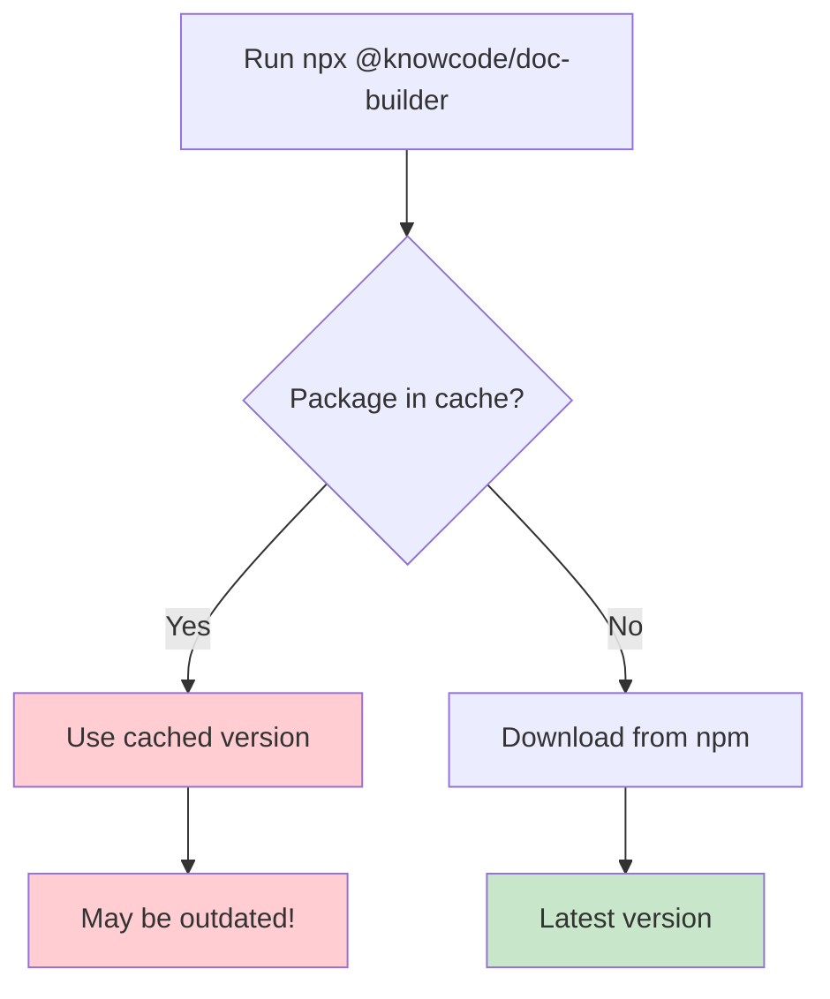

# Troubleshooting Guide for @knowcode/doc-builder

**Generated**: 2025-07-21 19:15 UTC  
**Status**: Complete  
**Verified**: ✅

## Overview

This guide helps you resolve common issues when using @knowcode/doc-builder. Most problems have simple solutions, and this guide covers the most frequent ones.

## NPX Cache Issues

### Problem
The most common issue users face is npx caching an older version of doc-builder.

**Symptoms:**
- ❌ Running `npx @knowcode/doc-builder` shows an old version number
- ❌ New features aren't available despite updating
- ❌ Bug fixes don't appear to be working
- ❌ Version shown doesn't match npm registry

**Example:**
```bash
$ npx @knowcode/doc-builder --version
1.4.11  # Old version!

# But npm shows:
$ npm view @knowcode/doc-builder version
1.4.22  # Latest version
```

### Solution

```bash
# Method 1: Clear the npx cache
npx clear-npx-cache

# Method 2: Force the latest version
npx @knowcode/doc-builder@latest

# Method 3: Specify exact version
npx @knowcode/doc-builder@1.4.22
```

### Why This Happens



NPX caches packages to improve performance, but this cache doesn't automatically update when new versions are published.

### Prevention

1. **Always use @latest for current version:**
   ```bash
   npx @knowcode/doc-builder@latest deploy
   ```

2. **For development, install globally:**
   ```bash
   npm install -g @knowcode/doc-builder
   doc-builder deploy
   ```

3. **For projects, install as dev dependency:**
   ```bash
   npm install --save-dev @knowcode/doc-builder
   npx doc-builder deploy  # Uses local version
   ```

## Build Issues

### No Markdown Files Found

**Error:** `No markdown files found in docs directory`

**Solutions:**

1. **Check directory structure:**
   ```bash
   ls -la docs/
   # Should show .md files
   ```

2. **Ensure correct file extensions:**
   - ✅ `README.md`
   - ✅ `guide.md`
   - ❌ `README.txt`
   - ❌ `guide.markdown`

3. **Use custom input directory:**
   ```bash
   npx @knowcode/doc-builder build --input my-docs
   ```

### Build Output Missing

**Problem:** HTML files not generated

**Check:**
1. Look in `html/` directory (default output)
2. Check for build errors in console
3. Verify markdown files are valid

**Solution:**
```bash
# Clean build
rm -rf html/
npx @knowcode/doc-builder build

# Check output
ls -la html/
```

## Deployment Issues

### Vercel CLI Not Found

**Error:** `Vercel CLI not found!`

**Solution:**
```bash
# Install Vercel CLI globally
npm install -g vercel

# Verify installation
vercel --version

# Then retry deployment
npx @knowcode/doc-builder deploy
```

### Deployment Fails

**Common causes:**

1. **Not Logged Into Vercel**
   ```bash
   # Login to Vercel first
   vercel login
   ```

2. **Build Not Complete**
   ```bash
   # Build before deploy
   npx @knowcode/doc-builder build
   npx @knowcode/doc-builder deploy
   ```

3. **Project Name Already Taken**
   - Choose a different project name
   - Or delete the existing project in Vercel dashboard

### Wrong Production URL Displayed

**Problem:** Deployment shows incorrect URL

**Solution 1:** Update to latest version
```bash
# Clear cache and update
npx clear-npx-cache
npx @knowcode/doc-builder@latest deploy
```

**Solution 2:** Set custom URL
```bash
# Set your actual production URL
npx @knowcode/doc-builder set-production-url https://my-docs.vercel.app
```

## Configuration Issues

### Config File Not Loading

**Symptoms:**
- Default settings used instead of custom config
- Site name shows "Documentation"

**Solutions:**

1. **Check file name:**
   - ✅ `doc-builder.config.js`
   - ❌ `docbuilder.config.js`
   - ❌ `doc-builder-config.js`

2. **Verify export format:**
   ```javascript
   // Correct
   module.exports = {
     siteName: 'My Docs'
   };
   
   // Wrong
   export default {
     siteName: 'My Docs'
   };
   ```

3. **Use explicit config path:**
   ```bash
   npx @knowcode/doc-builder build --config ./my-config.js
   ```

## Authentication Issues

### Login Page Not Working

**Check:**
1. Authentication enabled in config
2. Credentials match exactly (case-sensitive)
3. Cookies enabled in browser

**Debug:**
```javascript
// doc-builder.config.js
module.exports = {
  features: {
    authentication: true  // Must be true
  },
  auth: {
    username: 'admin',    // Case sensitive!
    password: 'secret'    // Case sensitive!
  }
};
```

## Styling Issues

### CSS Not Loading

**Symptoms:**
- Plain HTML without styling
- 404 errors for CSS files

**Fixed in:** v1.2.0+

**Solutions:**
1. Update to latest version
2. Check browser console for 404 errors
3. Verify `html/css/` directory exists after build

### Dark Mode Not Working

**Check:**
1. Feature enabled in config
2. Browser supports CSS variables
3. No conflicting styles

## Development Server Issues

### Port Already in Use

**Error:** `Port 3000 is already in use`

**Solutions:**
```bash
# Use different port
npx @knowcode/doc-builder dev --port 8080

# Find process using port
lsof -i :3000  # macOS/Linux
netstat -ano | findstr :3000  # Windows
```

### Hot Reload Not Working

**Common causes:**
1. File system events not supported
2. Saving files outside watched directory
3. Browser cache

**Solutions:**
- Hard refresh browser (Ctrl/Cmd + Shift + R)
- Check that files are in `docs/` directory
- Restart dev server

## Platform-Specific Issues

### Windows Path Issues

**Problem:** Paths with backslashes cause errors

**Solution:** Use forward slashes or escape backslashes:
```javascript
// Bad
docsDir: 'C:\Users\me\docs'

// Good
docsDir: 'C:/Users/me/docs'
// Or
docsDir: 'C:\\Users\\me\\docs'
```

### macOS Permission Issues

**Error:** `EACCES: permission denied`

**Solutions:**
1. Don't use sudo with npm/npx
2. Fix npm permissions:
   ```bash
   mkdir ~/.npm-global
   npm config set prefix '~/.npm-global'
   echo 'export PATH=~/.npm-global/bin:$PATH' >> ~/.zshrc
   source ~/.zshrc
   ```

## Getting Help

### Debug Information

When reporting issues, include:

1. **Version information:**
   ```bash
   npx @knowcode/doc-builder --version
   node --version
   npm --version
   ```

2. **Error messages:** Full error output

3. **Configuration:** Your `doc-builder.config.js` (remove passwords)

4. **Directory structure:**
   ```bash
   tree -L 2  # or ls -la
   ```

### Support Channels

1. **GitHub Issues:** Report bugs and feature requests
2. **npm Page:** Check for updates and documentation
3. **This Guide:** Reference for common problems

## Quick Reference

| Problem | Solution |
|---------|----------|
| Old version running | `npx clear-npx-cache` |
| Vercel deploy fails | `vercel login` then retry |
| No markdown found | Check `docs/` directory exists |
| CSS not loading | Update to latest version |
| Port in use | `--port 8080` |
| Config not loading | Check filename and format |
| 404 after deploy | Check Deployment Protection settings |

---

## Document History

| Date | Version | Author | Changes |
|------|---------|--------|---------|
| 2025-07-21 | 1.0 | System | Initial troubleshooting guide |