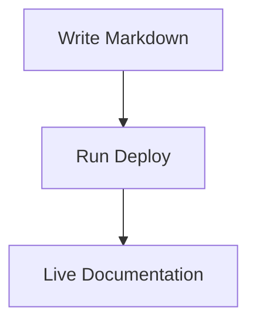

# Launch Announcement Templates

## Overview

This document contains ready-to-use announcement templates for launching @knowcode/doc-builder across various platforms and channels.

## Product Hunt Launch

### Title
**Doc Builder - Transform markdown into beautiful documentation sites**

### Tagline
Notion-inspired documentation generator with one-command Vercel deployment

### Description
Hey Product Hunt! 👋

I'm excited to share Doc Builder, a tool I built to solve my own documentation frustrations.

**The Problem:**
Every time I needed to create documentation for a project, I faced the same issues:
- Setting up a documentation framework took hours
- Most solutions were either too complex or too basic
- Deployment was always a separate headache
- The output rarely looked professional

**The Solution:**
Doc Builder transforms your markdown files into beautiful, searchable documentation sites with a single command. Think Notion meets documentation generator.

**Key Features:**
✨ **Notion-inspired design** - Clean, modern UI that readers love
🚀 **One-command deployment** - `npx @knowcode/doc-builder@latest deploy`
🔍 **Full-text search** - Find anything instantly
🌓 **Dark mode** - Easy on the eyes
📊 **Mermaid diagrams** - Visualize complex concepts
🔐 **Password protection** - Keep internal docs secure
📱 **Fully responsive** - Perfect on any device

**Perfect for:**
- Open source projects
- API documentation
- Team knowledge bases
- Technical guides
- Product documentation

**Try it now:**
```bash
npx @knowcode/doc-builder@latest init
npx @knowcode/doc-builder@latest deploy
```

Live demo: https://doc-builder-delta.vercel.app

Would love to hear your feedback and answer any questions!

### Gallery Images
1. Homepage screenshot showing Notion-inspired design
2. Dark mode example
3. Search functionality demo
4. Mermaid diagram example
5. Mobile responsive view

## Hacker News Post

### Title
Show HN: I built a documentation generator that deploys to Vercel in one command

### Post
I got tired of the complexity involved in creating good-looking documentation sites, so I built Doc Builder.

It's a simple tool that:
- Converts markdown to beautiful HTML (Notion-inspired design)
- Deploys to Vercel with zero configuration
- Includes search, dark mode, and syntax highlighting out of the box
- Supports Mermaid diagrams for visualizations

The entire flow is just:
```
npx @knowcode/doc-builder@latest init
npx @knowcode/doc-builder@latest deploy
```

I've been using it for all my projects and it's saved me hours of setup time. The output looks professional without any CSS tweaking.

Technical details:
- Built with Node.js
- Generates static HTML for performance
- SEO optimized with meta tags and structured data
- Optional password protection for private docs
- Automatic navigation generation from folder structure

Demo: https://doc-builder-delta.vercel.app
NPM: https://www.npmjs.com/package/@knowcode/doc-builder

The code is MIT licensed. Would love feedback from the HN community!

## Twitter/X Thread

### Thread

🧵 1/7
Just launched Doc Builder - a tool that transforms your markdown into beautiful documentation sites with ONE command 🚀

No more hours of setup. No more ugly docs.

npx @knowcode/doc-builder@latest deploy

That's it. You're live on Vercel.

2/7
The problem: Every documentation tool is either:
- Too complex (hours to configure)
- Too simple (looks unprofessional)
- Requires separate deployment setup
- Costs too much for small projects

I needed something better.

3/7
Doc Builder features:
✨ Notion-inspired design
🔍 Full-text search built-in
🌓 Automatic dark mode
📊 Mermaid diagram support
🔐 Optional password protection
📱 Mobile responsive
⚡ Lightning fast (static HTML)

4/7
Perfect for:
- Open source projects
- API documentation  
- Team wikis
- Technical guides
- Personal knowledge bases

Zero configuration needed. It just works.

5/7
The magic is in the simplicity:

1. Write markdown files
2. Run: npx @knowcode/doc-builder@latest init
3. Run: npx @knowcode/doc-builder@latest deploy
4. Your docs are live!

No build configs. No deployment scripts. No hassle.

6/7
Built this because I was tired of spending more time setting up docs than writing them.

Now I can focus on content, not configuration.

Check out the demo: doc-builder-delta.vercel.app

7/7
It's open source (MIT license) and available on npm today!

Would love your feedback. What features would make this even better for your documentation needs?

Try it: npmjs.com/package/@knowcode/doc-builder

#buildinpublic #documentation #webdev #opensource

## LinkedIn Post

### Post

🎉 Excited to announce the launch of Doc Builder - a developer tool that transforms markdown documentation into beautiful, searchable websites with just one command.

**The Challenge:**
As developers, we spend countless hours setting up documentation frameworks, configuring build tools, and wrestling with deployment pipelines. Time that could be better spent actually writing documentation or building features.

**The Solution:**
Doc Builder eliminates this complexity. With a single command, you can deploy professional-looking documentation to Vercel:

`npx @knowcode/doc-builder@latest deploy`

**Key Benefits:**
• ⏱️ Save hours of setup time
• 🎨 Professional Notion-inspired design out of the box
• 🔍 Built-in search functionality
• 🌓 Automatic dark mode support
• 📊 Mermaid diagram integration
• 🔐 Optional password protection
• 📱 Fully responsive design

**Who It's For:**
• Open source maintainers
• API developers
• Technical writers
• Development teams
• Anyone who needs beautiful documentation quickly

**Impact So Far:**
• 21 releases on npm
• Active community of early adopters
• Used in production by multiple projects

Try the live demo: https://doc-builder-delta.vercel.app

I'd love to connect with others passionate about developer tools and documentation. What's your biggest pain point when creating technical documentation?

#DeveloperTools #TechnicalDocumentation #OpenSource #WebDevelopment #ProductLaunch

## Dev.to Article

### Title
I Built a Documentation Generator That Deploys in One Command - Here's Why and How

### Tags
`webdev`, `javascript`, `opensource`, `productivity`

### Content
## The Problem That Started It All

Last month, I was starting my fifth project of the year, and once again, I found myself spending hours setting up documentation infrastructure. Configure this, install that, write deployment scripts, fix CSS issues... 

Sound familiar?

That's when I decided enough was enough. I needed a documentation tool that:
- Works out of the box
- Looks professional without customization
- Deploys with zero configuration
- Doesn't require a PhD in DevOps

## Enter Doc Builder

Doc Builder is a simple tool that transforms your markdown files into beautiful, searchable documentation sites. The entire setup and deployment process takes less than a minute.

### How It Works

1. **Install and Initialize**
```bash
npx @knowcode/doc-builder@latest init
```

This creates a simple structure:
```
your-project/
├── docs/
│   └── README.md
└── doc-builder.config.js
```

2. **Write Your Docs**
Just create markdown files in the `docs` folder. Doc Builder automatically:
- Generates navigation from your folder structure
- Extracts titles and summaries for tooltips
- Creates a searchable index
- Applies Notion-inspired styling

3. **Deploy to Production**
```bash
npx @knowcode/doc-builder@latest deploy
```

That's it! Your documentation is now live on Vercel with a public URL.

## Key Features That Make It Special

### 🎨 Beautiful by Default
I spent weeks perfecting the design so you don't have to. The Notion-inspired interface is clean, modern, and professional.

### 🔍 Search That Actually Works
Full-text search is built-in. No configuration needed. It just works.

### 🌓 Dark Mode
Automatic theme detection with manual toggle. Your readers' eyes will thank you.

### 📊 Mermaid Diagrams


### 🔐 Password Protection
Need private docs? Enable authentication with one config line:
```javascript
features: {
  authentication: true
}
```

## The Technical Details

For the curious developers, here's what's under the hood:

- **Static Site Generation**: Pure HTML/CSS/JS for maximum performance
- **Zero Dependencies**: No runtime framework needed
- **SEO Optimized**: Meta tags, structured data, sitemap generation
- **Responsive Design**: Mobile-first approach
- **Incremental Builds**: Only rebuilds changed files

## Real-World Usage

I've been dogfooding Doc Builder for all my projects:
- API documentation with code examples
- Internal team wikis
- Open source project docs
- Personal knowledge base

The feedback has been overwhelmingly positive. Developers love the simplicity and designers love the aesthetics.

## What's Next?

I'm working on:
- GitHub Action for automated deployments
- More themes (though many users love the current one)
- Plugin system for extensions
- Internationalization support

## Try It Yourself

```bash
# Create a test project
mkdir my-docs && cd my-docs

# Initialize
npx @knowcode/doc-builder@latest init

# Start local server
npx @knowcode/doc-builder@latest dev

# Deploy when ready
npx @knowcode/doc-builder@latest deploy
```

## Conclusion

Doc Builder is my answer to documentation complexity. It's open source, MIT licensed, and available on npm today.

If you're tired of spending more time on documentation setup than actual writing, give it a try. I'd love to hear your feedback!

**Links:**
- 🚀 [Live Demo](https://doc-builder-delta.vercel.app)
- 📦 [NPM Package](https://www.npmjs.com/package/@knowcode/doc-builder)
- 🐙 [GitHub Repo](https://github.com/knowcode/doc-builder) (coming soon)

What's your biggest documentation pain point? Let me know in the comments!

## Reddit Posts

### r/webdev

**Title:** I made a documentation generator that deploys to Vercel in literally one command

**Post:**
Hey r/webdev!

Just launched my latest project - Doc Builder. It's a tool that converts markdown to beautiful documentation sites and deploys them with a single command.

**Why I built it:**
I was tired of spending hours setting up documentation for every new project. Existing solutions were either too complex or produced ugly output.

**What it does:**
- Converts markdown → beautiful HTML (Notion-inspired design)
- One command deployment: `npx @knowcode/doc-builder@latest deploy`
- Includes search, dark mode, syntax highlighting
- Zero configuration needed

**Cool features:**
- Mermaid diagram support
- Password protection option
- Auto-generated navigation
- SEO optimized
- Fully responsive

**Tech stack:**
- Node.js
- Static HTML generation
- Vanilla JS (no framework dependencies)

Demo: https://doc-builder-delta.vercel.app

It's open source and on npm. Would love feedback from fellow developers!

### r/javascript

**Title:** [Showoff Saturday] Built a zero-config documentation generator in Node.js

**Post:**
For this Showoff Saturday, I want to share Doc Builder - a Node.js tool I built to solve my documentation woes.

**The problem:** Every documentation tool required tons of configuration and the output looked dated.

**My solution:** A tool that works out of the box with beautiful, modern output.

**Technical highlights:**
- Pure Node.js implementation
- Generates static HTML for performance
- No runtime dependencies
- Automatic code syntax highlighting
- Built-in search using lunr.js
- Mermaid integration for diagrams

**Usage:**
```javascript
// Programmatic API
const { build } = require('@knowcode/doc-builder');

await build({
  siteName: 'My Docs',
  docsDir: './docs',
  outputDir: './dist'
});
```

Or via CLI:
```bash
npx @knowcode/doc-builder@latest deploy
```

NPM: https://www.npmjs.com/package/@knowcode/doc-builder

Learned a lot building this, happy to answer technical questions!

## Email Newsletter

### Subject
🚀 Introducing Doc Builder: Beautiful Documentation in One Command

### Body
Hi {firstName},

Remember the last time you spent hours setting up documentation for a project?

The configuring, the styling, the deployment scripts... What if I told you all of that could be replaced with a single command?

**Introducing Doc Builder**

I built Doc Builder because I was tired of documentation taking longer to set up than to write. It's a simple tool that:

✅ Converts your markdown to beautiful, searchable websites
✅ Deploys to Vercel with zero configuration  
✅ Looks professional out of the box (Notion-inspired design)
✅ Includes dark mode, search, and syntax highlighting

**See It In Action**

```bash
npx @knowcode/doc-builder@latest deploy
```

That's it. Your documentation is live.

**Perfect For:**
- Open source projects
- API documentation
- Team knowledge bases
- Technical guides
- Personal wikis

**What Early Users Are Saying:**

*"Finally, a documentation tool that just works. No more wrestling with configs!"* - Sarah D., Frontend Developer

*"The design is beautiful. Our docs have never looked this good."* - Mike R., Team Lead

*"Saved us literally days of setup time across our projects."* - Jennifer K., CTO

**Try It Today**

Check out the live demo: https://doc-builder-delta.vercel.app

Or jump right in:
```bash
npm install -g @knowcode/doc-builder
doc-builder init
doc-builder deploy
```

**Special Launch Offer**

For the next 48 hours, I'm offering 50% off the Pro plan for early adopters. Use code LAUNCH50 when upgrading.

Questions? Just reply to this email. I personally read every message.

Happy documenting!

Best,
Lindsay Smith
Creator of Doc Builder

P.S. Doc Builder is open source and MIT licensed. If you find it useful, a GitHub star would mean the world to me! 🌟

---

## Press Release

### FOR IMMEDIATE RELEASE

**KnowCode Launches Doc Builder: A Revolutionary Documentation Tool That Deploys in One Command**

*New open-source tool transforms how developers create and deploy technical documentation*

**London, UK - July 22, 2025** - KnowCode Ltd today announced the public release of Doc Builder, an innovative documentation generator that dramatically simplifies the process of creating and deploying professional technical documentation.

Doc Builder addresses a long-standing pain point in software development: the complexity and time investment required to set up documentation infrastructure. With Doc Builder, developers can transform markdown files into beautiful, searchable documentation websites and deploy them to Vercel with a single command.

"We've eliminated hours of setup time," said Lindsay Smith, Creator of Doc Builder. "Developers can now focus on writing great documentation instead of configuring build tools and deployment pipelines."

**Key features include:**
- One-command deployment to Vercel
- Notion-inspired design that requires no customization
- Built-in full-text search functionality
- Automatic dark mode support
- Mermaid diagram integration
- Optional password protection for private documentation
- Mobile-responsive design

The tool has already gained traction in the developer community, with 21 releases published to npm and active adoption across various open-source projects.

"Doc Builder represents our commitment to creating developer tools that are both powerful and simple to use," added Smith. "We believe great documentation shouldn't require a complex setup process."

Doc Builder is available immediately as an open-source project under the MIT license. Developers can try it instantly using npx or install it via npm.

**About KnowCode Ltd**
KnowCode is a software company focused on creating innovative developer tools that simplify complex workflows. Founded in 2023, the company is committed to open-source development and community-driven innovation.

**Contact:**
Lindsay Smith
support@knowcode.tech
https://knowcode.tech

**Resources:**
- Live Demo: https://doc-builder-delta.vercel.app
- NPM Package: https://www.npmjs.com/package/@knowcode/doc-builder
- Documentation: https://doc-builder-delta.vercel.app

###

---

## Document History

| Date | Author | Changes |
|------|--------|---------|
| 2025-07-22 | System | Initial announcement templates |