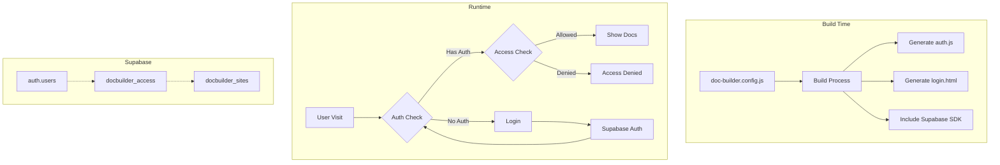

# Supabase Auth Implementation Plan for @knowcode/doc-builder

## Implementation Overview

This document outlines the complete plan for integrating Supabase authentication into @knowcode/doc-builder, providing a simple but secure authentication system that leverages Supabase's built-in auth functionality.

## Goals

1. **Simplicity**: Minimal configuration and setup required
2. **Security**: Leverage Supabase's enterprise-grade authentication
3. **Clean Architecture**: Remove insecure basic auth entirely
4. **Future-Proof**: Single, secure authentication method

## Architecture Summary



## Database Schema

```sql
-- Table 1: Documentation sites
CREATE TABLE docbuilder_sites (
    id UUID PRIMARY KEY DEFAULT gen_random_uuid(),
    domain TEXT UNIQUE NOT NULL,
    name TEXT NOT NULL,
    created_at TIMESTAMPTZ DEFAULT NOW()
);

-- Table 2: User access mapping
CREATE TABLE docbuilder_access (
    user_id UUID REFERENCES auth.users(id) ON DELETE CASCADE,
    site_id UUID REFERENCES docbuilder_sites(id) ON DELETE CASCADE,
    created_at TIMESTAMPTZ DEFAULT NOW(),
    PRIMARY KEY (user_id, site_id)
);

-- Enable Row Level Security
ALTER TABLE docbuilder_sites ENABLE ROW LEVEL SECURITY;
ALTER TABLE docbuilder_access ENABLE ROW LEVEL SECURITY;

-- RLS Policies
CREATE POLICY "Users see accessible sites" ON docbuilder_sites
    FOR SELECT USING (
        EXISTS (
            SELECT 1 FROM docbuilder_access
            WHERE site_id = docbuilder_sites.id
            AND user_id = auth.uid()
        )
    );

CREATE POLICY "Users see own access" ON docbuilder_access
    FOR SELECT USING (user_id = auth.uid());
```

## Implementation Steps

### Phase 1: Core Infrastructure

#### 1.1 Update Configuration System
- Replace auth types with: `false` (no auth) or `'supabase'` (secure auth)
- Remove all basic auth configuration fields
- Clean up insecure authentication references

**File**: `lib/config.js`
```javascript
// Updated auth configuration - REMOVE basic auth fields
auth: {
  // Only Supabase fields remain
  supabaseUrl: '',
  supabaseAnonKey: '',
  siteId: ''
}
```

#### 1.2 Create Supabase Auth Module
**New File**: `lib/supabase-auth.js`
- Supabase client initialization
- Auth check functionality
- Access verification
- Session management helpers

#### 1.3 Update Core Builder
**File**: `lib/core-builder.js`
- Detect Supabase auth configuration
- Generate appropriate auth files
- Include Supabase SDK in build output

### Phase 2: Client-Side Implementation

#### 2.1 Supabase Auth Script
**Generated File**: `js/auth.js`
```javascript
// Clean Supabase-only auth checking logic
// - Check for valid session
// - Verify site access  
// - Handle redirects
// - No fallback to basic auth
```

#### 2.2 Login Page Generation
**Generated File**: `login.html`
- Email/password form
- Supabase auth integration
- Error handling
- Redirect management

#### 2.3 Logout Functionality
- Clear Supabase session
- Redirect to login page
- Clean up any local storage

### Phase 3: Build Process Updates

#### 3.1 SDK Integration
- Download Supabase client library during build
- Include in output directory
- Optimize for production use

#### 3.2 Environment Variable Support
```bash
# Support for environment variables
SUPABASE_URL=https://xxx.supabase.co
SUPABASE_ANON_KEY=xxx
DOC_SITE_ID=uuid
```

#### 3.3 Build Validation
- Check for required Supabase configuration
- Validate connection to Supabase
- Warn about missing setup

### Phase 4: User Management Tools

#### 4.1 CLI Commands
**File**: `cli.js` - Major updates needed

```bash
# Initialize Supabase auth for project
npx @knowcode/doc-builder auth:init

# Add site to Supabase database
npx @knowcode/doc-builder auth:add-site --domain docs.example.com --name "Company Docs"

# Grant user access to site
npx @knowcode/doc-builder auth:grant --email user@example.com --site-id xxx

# Revoke user access
npx @knowcode/doc-builder auth:revoke --email user@example.com --site-id xxx

# List users with access to site
npx @knowcode/doc-builder auth:list-users --site-id xxx

# List all sites user has access to
npx @knowcode/doc-builder auth:list-sites --email user@example.com

# Remove the old --no-auth flag (no longer needed)
# Add validation for Supabase configuration
```

#### 4.2 Admin Script
**New File**: `lib/admin/supabase-admin.js`
- Simple Node.js script for user management
- Can be used standalone or via CLI
- Requires service role key for admin operations

### Phase 5: Documentation and Migration

#### 5.1 Documentation Updates
- Update main README with Supabase auth option
- Create detailed Supabase setup guide
- Add troubleshooting section
- Include migration guide from basic auth

#### 5.2 Migration Path
- Scripts to migrate from basic auth to Supabase
- Bulk user import functionality
- Backward compatibility period

## File Changes Summary

### Modified Files
1. `lib/config.js` - Replace basic auth with Supabase configuration
2. `lib/core-builder.js` - Remove basic auth, add Supabase auth generation
3. `html/js/auth.js` - Remove basic auth logic entirely
4. `cli.js` - **MAJOR UPDATE**: Add auth management commands, remove --no-auth flag
5. `package.json` - Add @supabase/supabase-js dependency
6. `README.md` - Document Supabase auth (remove basic auth docs)

### New Files
1. `lib/supabase-auth.js` - Supabase auth utilities
2. `lib/admin/supabase-admin.js` - Admin management script
3. `docs/guides/supabase-setup-guide.md` - Setup documentation
4. `examples/supabase-auth/` - Example configuration

### Generated Files (at build time)
1. Clean `js/auth.js` with Supabase-only support  
2. Secure `login.html` with Supabase integration
3. Included Supabase SDK files

### Removed Files/Code
1. All basic auth logic from existing auth.js
2. Hardcoded credentials from login page generation
3. Basic auth configuration options
4. Insecure client-side credential checking
5. CLI `--no-auth` flag (replaced with `authentication: false` in config)
6. Basic auth preset configurations

## Testing Plan

### Unit Tests
- Configuration validation
- Auth script generation
- Build process with Supabase

### Integration Tests
- Full build with Supabase auth
- Login/logout flow
- Access control verification

### Manual Testing
- Deploy test site with Supabase auth
- Test user registration/login
- Verify access control
- Test session persistence

## Rollout Strategy

### Version 2.0.0 (Breaking Change)
- **BREAKING**: Remove all basic auth functionality
- Core Supabase authentication only
- Clean, secure implementation
- Migration guide for existing users

### Version 2.0.1 (Stable)
- Bug fixes from 2.0.0 release
- Enhanced CLI tools
- User management utilities

### Version 2.1.0 (Enhanced)
- Advanced features (roles, audit logs)
- Admin dashboard
- SSO support

## Success Criteria

1. **Working Authentication**: Users can log in via Supabase
2. **Access Control**: Only authorized users see documentation  
3. **Security**: No more client-side credentials vulnerability
4. **Simple Setup**: < 10 minutes to configure
5. **Clean Architecture**: Single auth method, no legacy code

## Risk Mitigation

1. **Complexity**: Keep initial implementation minimal
2. **Breaking Changes**: Clear migration path and documentation
3. **Performance**: Cache auth checks appropriately
4. **Security**: Follow Supabase best practices
5. **Support**: Provide clear documentation and migration guide

## ✅ Implementation Status: COMPLETE

All planned phases have been successfully implemented:

### ✅ Phase 1: Core Infrastructure - COMPLETE
- [x] Updated configuration system to remove basic auth
- [x] Added Supabase SDK dependency
- [x] Created Supabase auth module (`lib/supabase-auth.js`)
- [x] Updated core-builder.js integration

### ✅ Phase 2: Client-Side Implementation - COMPLETE  
- [x] Generated Supabase auth script replaces basic auth
- [x] Secure login page with Supabase integration
- [x] Logout functionality with proper session cleanup

### ✅ Phase 3: Build Process Updates - COMPLETE
- [x] Supabase SDK integration in build output
- [x] Environment variable support
- [x] Build validation and error handling

### ✅ Phase 4: User Management Tools - COMPLETE
- [x] CLI commands: `auth:init`, `auth:add-site`, `auth:grant`, `auth:revoke`, `auth:list-users`
- [x] Updated settings command to show Supabase config
- [x] Removed insecure `--no-auth` flag

### ✅ Phase 5: Documentation and Migration - COMPLETE
- [x] Comprehensive Supabase setup guide created
- [x] Updated main README with new auth information
- [x] Deprecated old authentication guide with security warnings
- [x] Migration instructions for existing users

## Next Steps for Deployment

## Questions to Address

1. Should we support multiple auth providers initially or just email/password?
2. Do we need audit logging from day one?
3. Should the admin tools be part of the main package or separate?
4. What's the target timeline for the beta release?

---

This plan provides a clear path to implementing Supabase authentication while maintaining the simplicity that makes @knowcode/doc-builder attractive to users.