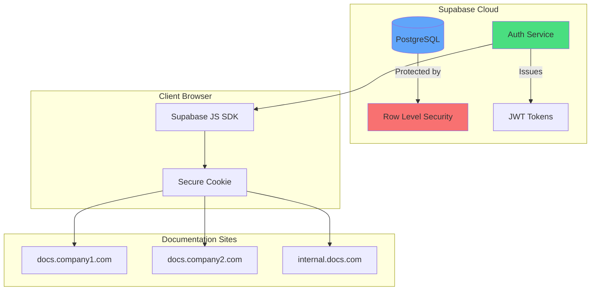
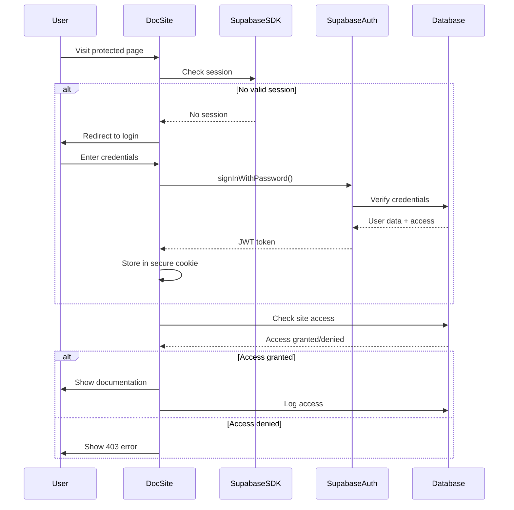

# Supabase Authentication Integration Plan for @knowcode/doc-builder

## Vision

Transform @knowcode/doc-builder from basic client-side authentication to a sophisticated, centralized authentication system powered by Supabase that enables:

- **Single Sign-On (SSO)** across all deployed documentation sites
- **Multi-tenant support** with fine-grained access control
- **Enterprise-grade security** with JWT tokens and Row Level Security
- **Scalable user management** for teams of any size
- **Audit logging** for compliance and security

## Architecture Overview



## Database Schema

### Simplified Domain-Based Design

```sql
-- Single table for user access control
CREATE TABLE docbuilder_access (
    user_id UUID REFERENCES auth.users(id) ON DELETE CASCADE,
    domain TEXT NOT NULL,
    created_at TIMESTAMPTZ DEFAULT NOW(),
    PRIMARY KEY (user_id, domain)
);

-- Create index for faster lookups
CREATE INDEX idx_docbuilder_access_domain ON docbuilder_access(domain);

-- Optional: Access logs for audit trail
CREATE TABLE access_logs (
    id UUID PRIMARY KEY DEFAULT gen_random_uuid(),
    user_id UUID REFERENCES auth.users(id),
    domain TEXT NOT NULL,
    action TEXT NOT NULL,
    metadata JSONB DEFAULT '{}'::jsonb,
    ip_address INET,
    user_agent TEXT,
    created_at TIMESTAMPTZ DEFAULT NOW()
);
```

### Row Level Security Policies

```sql
-- Enable RLS on tables
ALTER TABLE docbuilder_access ENABLE ROW LEVEL SECURITY;
ALTER TABLE access_logs ENABLE ROW LEVEL SECURITY;

-- Users can only see their own access records
CREATE POLICY "Users see own access" ON docbuilder_access
    FOR SELECT USING (user_id = auth.uid());

-- Access logs are append-only by authenticated users
CREATE POLICY "Insert access logs" ON access_logs
    FOR INSERT WITH CHECK (user_id = auth.uid());

-- Users can view their own access logs
CREATE POLICY "View own access logs" ON access_logs
    FOR SELECT USING (user_id = auth.uid());
```

## Implementation Architecture

### 1. Authentication Flow



### 2. Client-Side Implementation

```javascript
// lib/supabase-auth.js
import { createClient } from '@supabase/supabase-js';

class SupabaseAuthManager {
  constructor(config) {
    this.supabase = createClient(
      config.supabaseUrl,
      config.supabaseAnonKey,
      {
        auth: {
          persistSession: true,
          autoRefreshToken: true,
          detectSessionInUrl: true
        }
      }
    );
  }

  async checkAccess() {
    const { data: { user } } = await this.supabase.auth.getUser();
    if (!user) return false;

    // Use current domain for access check
    const domain = window.location.host;
    
    const { data, error } = await this.supabase
      .from('docbuilder_access')
      .select('created_at')
      .eq('user_id', user.id)
      .eq('domain', domain)
      .single();

    if (error || !data) return false;
    if (data.expires_at && new Date(data.expires_at) < new Date()) return false;
    
    // Log access
    await this.logAccess('page_view');
    
    return data;
  }

  async signIn(email, password) {
    const { data, error } = await this.supabase.auth.signInWithPassword({
      email,
      password
    });

    if (error) throw error;

    // Check if user has access to this site
    const access = await this.checkAccess();
    if (!access) {
      await this.supabase.auth.signOut();
      throw new Error('You do not have access to this documentation site');
    }

    return data;
  }

  async signInWithMagicLink(email) {
    const { error } = await this.supabase.auth.signInWithOtp({
      email,
      options: {
        emailRedirectTo: window.location.origin
      }
    });

    if (error) throw error;
  }

  async logAccess(action, metadata = {}) {
    await this.supabase.from('access_logs').insert({
      domain: window.location.host,
      action,
      metadata,
      ip_address: await this.getClientIP(),
      user_agent: navigator.userAgent
    });
  }
}
```

### 3. Build-Time Integration

```javascript
// lib/core-builder.js modifications
async function buildWithSupabaseAuth(config) {
  if (config.features.authentication === 'supabase') {
    // Inject Supabase configuration
    const supabaseConfig = {
      supabaseUrl: config.auth.supabaseUrl,
      supabaseAnonKey: config.auth.supabaseAnonKey
      // Domain is detected automatically from window.location.host
    };

    // Create enhanced auth.js with Supabase integration
    const authScript = generateSupabaseAuthScript(supabaseConfig);
    await fs.writeFile(
      path.join(outputDir, 'js', 'auth.js'),
      authScript
    );

    // Create login page with Supabase UI
    const loginPage = generateSupabaseLoginPage(config);
    await fs.writeFile(
      path.join(outputDir, 'login.html'),
      loginPage
    );

    // Add Supabase SDK to dependencies
    await injectSupabaseSDK(outputDir);
  }
}
```

## Configuration Options

### Enhanced doc-builder.config.js

```javascript
module.exports = {
  siteName: 'Internal Documentation',
  
  features: {
    authentication: 'supabase', // 'basic' | 'supabase' | false
  },
  
  auth: {
    // Supabase configuration
    supabaseUrl: process.env.SUPABASE_URL,
    supabaseAnonKey: process.env.SUPABASE_ANON_KEY
    // Domain-based authentication - no siteId needed
    
    // Optional: Custom login page styling
    loginTheme: {
      logo: '/assets/logo.png',
      primaryColor: '#4F46E5',
      backgroundImage: '/assets/login-bg.jpg'
    },
    
    // Optional: Authentication providers
    providers: ['email', 'google', 'github'],
    
    // Optional: Custom redirect after login
    redirectUrl: '/',
    
    // Optional: Require email verification
    requireEmailVerification: false,
    
    // Optional: Session timeout (minutes)
    sessionTimeout: 1440, // 24 hours
    
    // Optional: Enable SSO
    sso: {
      enabled: true,
      domain: 'company.com'
    }
  }
};
```

## Migration Strategy

### Phase 1: Backward Compatibility (Week 1-2)
1. Add Supabase as optional authentication method
2. Keep existing basic auth as default
3. Allow configuration to choose auth type
4. No breaking changes to existing deployments

### Phase 2: Feature Parity (Week 3-4)
1. Implement core Supabase authentication
2. Add login/logout pages with Supabase UI
3. Implement access checking
4. Add basic user management CLI commands

### Phase 3: Advanced Features (Week 5-6)
1. Multi-site SSO support
2. Role-based access control
3. Invitation system
4. Audit logging
5. Admin dashboard

### Phase 4: Migration Tools (Week 7-8)
1. Migration script from basic auth to Supabase
2. Bulk user import
3. Documentation and guides
4. Deprecation notices for basic auth

## CLI Commands

### New Authentication Commands

```bash
# Initialize Supabase auth for a project
npx @knowcode/doc-builder auth init

# Add a user to documentation site
npx @knowcode/doc-builder auth add-user email@example.com --role editor

# Generate invitation link
npx @knowcode/doc-builder auth invite email@example.com --expires 7d

# List users with access
npx @knowcode/doc-builder auth list-users

# Revoke access
npx @knowcode/doc-builder auth revoke email@example.com

# View access logs
npx @knowcode/doc-builder auth logs --days 30
```

## Security Benefits

### Current Basic Auth Vulnerabilities
- ❌ Credentials visible in browser
- ❌ No password hashing
- ❌ No session management
- ❌ No audit trail
- ❌ Single shared password

### Supabase Auth Security
- ✅ Server-side authentication
- ✅ Bcrypt password hashing
- ✅ JWT tokens with expiration
- ✅ Row Level Security
- ✅ Comprehensive audit logs
- ✅ Multi-factor authentication support
- ✅ OAuth provider support

## Cost Analysis

### Supabase Free Tier
- 50,000 Monthly Active Users
- Unlimited authentication providers
- Row Level Security
- Real-time subscriptions

### Estimated Usage
- Small teams (< 100 users): **Free**
- Medium organizations (< 5,000 users): **Free**
- Large enterprises (< 50,000 users): **Free**
- Very large (> 50,000 users): **$25/month** Pro tier

## Implementation Timeline

### Week 1-2: Foundation
- [ ] Add Supabase SDK integration
- [ ] Create database schema
- [ ] Implement basic auth flow
- [ ] Update configuration system

### Week 3-4: Core Features
- [ ] Build login/logout pages
- [ ] Implement access checking
- [ ] Add session management
- [ ] Create CLI commands

### Week 5-6: Advanced Features
- [ ] Multi-site SSO
- [ ] Role management
- [ ] Invitation system
- [ ] Audit logging

### Week 7-8: Polish & Migration
- [ ] Migration tools
- [ ] Documentation
- [ ] Testing & QA
- [ ] Release preparation

## Benefits Summary

### For End Users
- **Single Sign-On**: One account for all documentation
- **Better Security**: Enterprise-grade authentication
- **Password Recovery**: Self-service password reset
- **OAuth Login**: Sign in with Google/GitHub

### For Administrators
- **User Management**: Add/remove users easily
- **Access Control**: Fine-grained permissions
- **Audit Trail**: Complete access history
- **Compliance**: Meet security requirements

### For Developers
- **Easy Integration**: Simple configuration
- **Extensible**: Add custom auth logic
- **Well-Documented**: Comprehensive guides
- **Open Source**: Fully transparent

## Next Steps

1. **Validate Architecture**: Review with team
2. **Create Prototype**: Build proof of concept
3. **Security Review**: Audit implementation
4. **Documentation**: Write integration guides
5. **Beta Testing**: Deploy to test sites
6. **Release**: Publish new version

## Conclusion

This Supabase integration transforms @knowcode/doc-builder from a basic documentation generator into an enterprise-ready documentation platform with professional authentication and access control. The centralized auth approach enables organizations to manage documentation access across multiple sites while maintaining security and compliance.