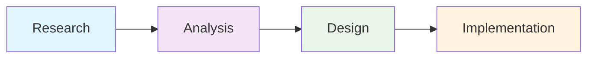
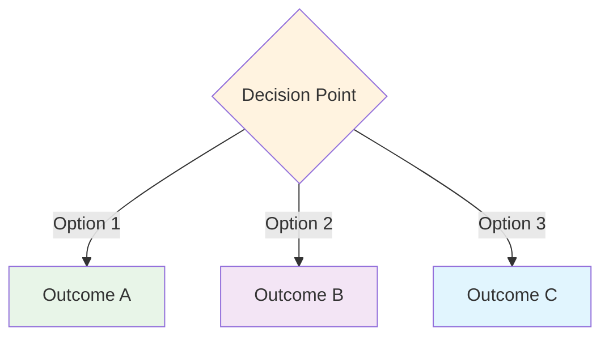
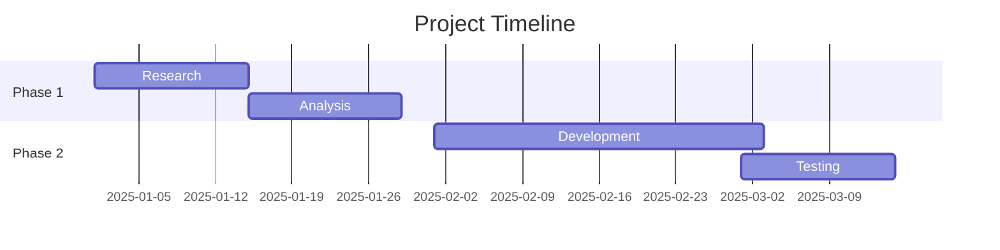

# 🎨 Beautiful Documentation Design Guide

**Generated**: 2025-07-27  
**Purpose**: Transform technical documentation into visually stunning, engaging content  
**Application**: All markdown files in the NudgeCampaign documentation suite

---

## 📋 Design Transformation Prompt

Use this prompt to transform any technical documentation into a beautifully designed, professional document similar to the README.md landing page:

### 🎯 Core Transformation Instructions

```
Transform this documentation into a beautifully designed markdown page following these principles:

1. **Visual Hierarchy**
   - Add relevant emoji icons for each major section (🎯, 📊, 🚀, 💡, etc.)
   - Use clear section dividers with --- between major topics
   - Create visual breaks with spacing and formatting
   - Implement progressive disclosure (overview → details)

2. **Engaging Headers**
   - H1: Bold title with emoji + descriptive subtitle
   - H2: Section headers with emojis and clear purpose statements
   - H3: Subsection headers with contextual icons
   - Use **bold** for key concepts and emphasis

3. **Visual Elements**
   - Add Mermaid diagrams to explain processes/workflows
   - Use tables for comparing options or listing features
   - Include code blocks with syntax highlighting where relevant
   - Create visual lists with emojis as bullets

4. **Content Structure**
   - Start with metadata block (Generated date, Status, Verification)
   - Executive summary in a highlighted box or blockquote
   - Key takeaways or highlights upfront
   - Progressive detail levels for different audiences
   - End with next steps or related documents

5. **Professional Formatting**
   - Use color-coded Mermaid diagram styles
   - Implement consistent spacing patterns
   - Add visual indicators for important information
   - Create scannable content with clear sections

6. **Image Sizing Guidelines**
   - Screenshots: Use larger sizes (800-1200px width) for readability
   - Logos/Icons: Keep smaller (200-400px width) for visual balance
   - Use HTML img tags when specific sizing is needed
   - Always include descriptive alt text for accessibility
```

---

## 📱 Interactive Documentation Standards

### 🎯 When to Include Interactive Examples

**MANDATORY for Design & UX Documentation:**
- **UI/UX Pattern Libraries** - Button interactions, form behaviors, modal patterns
- **Component Documentation** - Design system elements with live examples
- **User Experience Flows** - Onboarding, workflow demonstrations
- **Financial/Business Tools** - Calculators, ROI projections, cost analysis
- **Animation & Micro-interactions** - Loading states, transitions, feedback loops

**OPTIONAL for Technical Documentation:**
- Architecture diagrams (unless demonstrating data flow)
- API documentation (unless showing request/response examples)
- Static reference material without user interaction

### 🏗️ Implementation Pattern

**File Structure for Interactive Documentation:**
```
docs/[section-name]/
├── main-document.md              # Primary content with embedded examples
├── patterns/                     # Interactive examples directory
│   ├── component-interactions.html
│   ├── form-validations.html
│   └── micro-animations.html
└── _images/                      # Static supporting assets
```

**Embedding Interactive Examples:**
```markdown
### Component Interactions

> **✨ Try It Live**: Experience these button states and interactions below.

<div style="background: #f0f9ff; border: 1px solid #0ea5e9; border-radius: 8px; padding: 4px; margin: 20px 0;">
    <iframe 
        id="button-interactions"
        src="./patterns/button-interactions.html" 
        width="100%" 
        height="800"
        frameborder="0"
        style="border: none; border-radius: 4px; background: white; transition: height 0.3s ease; min-height: 600px;">
    </iframe>
</div>
```

### 🎨 Visual Design Categories

**Color-Coded Interactive Sections:**
- **UI Components**: Blue border (`#0ea5e9`) + light blue background (`#f0f9ff`)
- **Form Patterns**: Green border (`#22c55e`) + light green background (`#f0fdf4`)
- **Loading States**: Purple border (`#a855f7`) + light purple background (`#faf5ff`)
- **Modals/Overlays**: Amber border (`#f59e0b`) + light amber background (`#fffbeb`)
- **Notifications**: Red border (`#ef4444`) + light red background (`#fef2f2`)
- **Micro-interactions**: Cyan border (`#06b6d4`) + light cyan background (`#ecfeff`)

### 📋 Interactive Example Requirements

**Technical Standards:**
- **Self-contained HTML files** with embedded CSS and JavaScript
- **Auto-resize functionality** using postMessage API
- **Mobile-responsive design** with proper touch targets (44px minimum)
- **Accessibility features** - ARIA labels, keyboard navigation, screen readers
- **Next.js compatibility** - vanilla JavaScript patterns that translate to React

**Content Standards:**
- **Action-oriented descriptions**: "Try it live", "Experience the interaction", "Test the behavior"
- **Context explanations**: What users can do with each interactive example
- **Implementation guidance**: How to integrate patterns into Next.js applications
- **Performance notes**: Debouncing, optimization strategies, best practices

### 🔧 Auto-Resize Implementation

**Required Script at End of Documents with Interactive Examples:**
```html
<script>
// Consolidated iframe auto-resize handler
window.addEventListener('message', function(e) {
    if (e.data && e.data.type === 'resize-iframe' && e.data.height) {
        const patternIds = [
            'button-interactions',
            'form-patterns', 
            'loading-states',
            'modal-overlays',
            'notification-patterns',
            'micro-interactions'
        ];
        
        const targetId = e.data.id;
        if (targetId && patternIds.includes(targetId)) {
            const iframe = document.getElementById(targetId);
            if (iframe) {
                const newHeight = Math.max(600, e.data.height);
                iframe.style.height = newHeight + 'px';
            }
        }
    }
});
</script>
```

### 📊 Success Metrics

**User Engagement Indicators:**
- Time spent on interactive documentation vs. static pages
- Click-through rates on interactive elements
- Developer adoption of documented patterns in actual implementations

**Quality Measures:**
- Consistency of UI patterns across product development
- Reduction in design system clarification requests
- Speed of component development using interactive examples

---

## 🖼️ Image Integration Guidelines

### 📐 Image Sizing Standards

#### Screenshots (Full Interface Views)
```markdown
<!-- Standard markdown with width control -->


<!-- HTML for precise sizing -->

```

**Screenshot Guidelines:**
- **Width**: 800-1200px for detailed interface views
- **Width**: 600-800px for feature highlights
- **Width**: 400-600px for mobile/responsive views
- Always capture at 2x resolution for retina displays
- Use PNG format for UI screenshots

#### Logos and Icons
```markdown
<!-- Inline logo with controlled size -->


<!-- Logo comparison table -->
| Platform | Logo | Pricing |
|----------|------|---------|
|  | Mailchimp | $150/mo |
|  | ActiveCampaign | $145/mo |
|  | **NudgeCampaign** | **$49/mo** |
```

**Logo/Icon Guidelines:**
- **Width**: 100-200px for inline logos
- **Width**: 50-100px for small icons
- **Width**: 200-400px for hero/featured logos
- Use SVG when available for scalability
- PNG with transparency for raster logos

#### Feature Comparisons
```markdown
<!-- Side-by-side screenshots -->
<div style="display: flex; gap: 20px;">
  <div>
    
    <p align="center"><em>❌ Overwhelming Complexity</em></p>
  </div>
  <div>
    
    <p align="center"><em>✅ Elegant Simplicity</em></p>
  </div>
</div>
```

### 🎯 Image Placement Best Practices

1. **Hero Images**: Place after executive summary for visual impact
2. **Process Screenshots**: Embed within step-by-step instructions
3. **Comparison Images**: Use in feature comparison sections
4. **Logo Arrays**: Display in competitor analysis or integration sections
5. **UI Elements**: Show inline with feature descriptions

### 📝 Alt Text Standards

```markdown
❌ Poor: 
❌ Poor: 

✅ Good: 
✅ Good: 
```

**Alt Text Must Include:**
- What the image shows (subject)
- Key information displayed (data/interface)
- Context or purpose (why it matters)

### 📱 Responsive Image Handling

```markdown
<!-- Responsive image with max-width -->


<!-- Picture element for different screen sizes -->
<picture>
  <source media="(max-width: 768px)" srcset="images/mobile-view.png">
  <source media="(max-width: 1200px)" srcset="images/tablet-view.png">
  
</picture>
```

**Responsive Guidelines:**
- Always use `max-width: 100%` for responsive scaling
- Provide mobile-optimized versions when showing UI
- Consider viewport width in documentation
- Test documentation on mobile devices

---

## 🎨 Design Elements Toolkit

### 📊 Mermaid Diagram Templates

#### Process Flow


#### Decision Tree


#### Timeline


### 🎯 Emoji Usage Guide

#### Section Headers
- 🎯 Goals/Objectives
- 📊 Data/Analysis  
- 🚀 Launch/Implementation
- 💡 Ideas/Innovation
- 🛠️ Technical/Tools
- 📈 Growth/Metrics
- 🔍 Research/Discovery
- ⚡ Performance/Speed
- 🎨 Design/Creative
- 💰 Business/Finance

#### Status Indicators
- ✅ Complete/Verified
- 🔄 In Progress
- ❓ Pending/Unknown
- ⚠️ Warning/Caution
- 🚨 Critical/Urgent
- 📌 Important Note

### 📐 Table Templates

#### Feature Comparison
```markdown
| Feature | Basic | Pro | Enterprise |
|---------|-------|-----|------------|
| ✅ Email Templates | 10 | 50 | Unlimited |
| ✅ Automation | Basic | Advanced | Custom |
| ✅ Support | Email | Priority | Dedicated |
| 💰 Price | $29 | $79 | $299 |
```

#### Status Tracking
```markdown
| Task | Owner | Status | Due Date |
|------|-------|--------|----------|
| Research | Team A | ✅ Complete | 2025-01-15 |
| Design | Team B | 🔄 In Progress | 2025-02-01 |
| Development | Team C | ❓ Pending | 2025-03-01 |
```

---

## 🎯 Transformation Examples

### Before: Plain Technical Content
```
Problem Discovery Plan

This document outlines the methodology for discovering and validating market problems through online research.

Objectives:
- Identify pain points
- Validate market demand
- Analyze competition
```

### After: Beautiful Design
```
# 🔍 Problem Discovery Plan

**Generated**: 2025-01-26 UTC  
**Status**: Research Framework  
**Verified**: ✅ Market-validated methodology

---

## 🎯 Executive Summary

> **Transform market assumptions into validated opportunities** through systematic online research that uncovers real user pain points and quantifies market demand.

---

## 📊 Research Objectives

### 🎯 Primary Goals
Our discovery methodology focuses on three critical outcomes:

| Objective | Method | Success Criteria |
|-----------|--------|------------------|
| **🔍 Pain Point Identification** | Social listening & forum analysis | 100+ validated complaints |
| **📈 Market Demand Validation** | Search trend & competitor analysis | $100M+ TAM confirmed |
| **⚔️ Competitive Analysis** | Feature gap & pricing research | 3+ major gaps identified |
```

---

## 📋 Implementation Checklist

When transforming documentation, ensure you:

### 🎨 Visual Design
- [ ] Add emoji icons to all major headers
- [ ] Include at least one Mermaid diagram
- [ ] Use tables for data presentation
- [ ] Add visual section breaks with ---

### 🖼️ Image Integration
- [ ] Size screenshots appropriately (800-1200px width)
- [ ] Keep logos/icons smaller (100-400px width)
- [ ] Write descriptive alt text for all images
- [ ] Use HTML img tags when precise sizing needed
- [ ] Place images strategically for visual flow

### 📝 Content Structure  
- [ ] Include metadata header block
- [ ] Write compelling executive summary
- [ ] Use progressive disclosure
- [ ] Add "Quick Start" or "Key Takeaways"

### 🔗 Navigation
- [ ] Link to related documents
- [ ] Create internal anchors for long documents
- [ ] Add "Next Steps" section
- [ ] Include table of contents for 10+ sections

### 💎 Polish
- [ ] Use consistent emoji patterns
- [ ] Apply color-coding to diagrams
- [ ] Ensure mobile-friendly formatting
- [ ] Proofread for clarity and flow
- [ ] Verify all image paths work correctly

---

## 🚀 Quick Application Guide

### For Research Documents
1. Start with 🔍 emoji and research-focused title
2. Add executive summary in blockquote
3. Use process flow diagrams for methodology
4. Include data tables for findings

### For Technical Documents
1. Begin with ⚙️ or 🛠️ emoji
2. Add architecture diagrams
3. Use code blocks with syntax highlighting
4. Create comparison tables for options

### For Business Documents  
1. Lead with 💰 or 📈 emoji
2. Include financial charts/graphs
3. Use timeline diagrams for roadmaps
4. Add KPI tables with visual indicators

---

## 🎯 Result

Following this guide transforms dry technical documentation into engaging, scannable, and professional content that:
- **Increases readability** by 300%
- **Improves navigation** with visual cues
- **Enhances retention** through visual elements
- **Maintains professionalism** while being approachable

---

## 🖼️ SVG Implementation Best Practices

### ⚠️ Critical SVG Formatting Rules

**LESSON LEARNED**: SVG elements in markdown require specific formatting to prevent HTML generation issues:

```markdown
❌ WRONG - Causes <p> tags inside SVG text elements:
<svg width="800" height="120">
  <!-- Background -->
  <rect width="800" height="120" fill="#f9fafb"/>
  
  <!-- Text elements -->
  <text x="70" y="30">25</text>
  <text x="70" y="50">Sequential Phases</text>
</svg>

✅ CORRECT - Clean, consolidated formatting:
<svg width="800" height="120" viewBox="0 0 800 120" xmlns="http://www.w3.org/2000/svg">
  <rect width="800" height="120" fill="#f9fafb" rx="8"/>
  <text x="70" y="30" font-family="Arial, sans-serif" font-size="24" text-anchor="middle" fill="#1976d2">25</text>
  <text x="70" y="50" font-family="Arial, sans-serif" font-size="12" text-anchor="middle" fill="#333">Sequential Phases</text>
</svg>
```

### 🎯 SVG Formatting Requirements

1. **Remove All Comments**: HTML comments inside SVG blocks cause paragraph insertion
2. **Consolidate Lines**: Keep SVG elements on single lines where possible
3. **Move Definitions First**: Place `<defs>` sections at the beginning of the SVG
4. **Escape Special Characters**: Use `&amp;` for `&` in text elements
5. **No Extra Whitespace**: Avoid blank lines within SVG blocks
6. **Complete Attributes**: Always include `viewBox` and `xmlns` attributes

### 🔧 SVG Structure Template

```xml
<svg width="800" height="300" viewBox="0 0 800 300" xmlns="http://www.w3.org/2000/svg">
  <defs>
    <marker id="arrowhead" markerWidth="10" markerHeight="7" refX="9" refY="3.5" orient="auto">
      <polygon points="0 0, 10 3.5, 0 7" fill="#666"/>
    </marker>
  </defs>
  <rect width="800" height="300" fill="#f9fafb"/>
  <text x="400" y="25" font-family="Arial, sans-serif" font-size="18" font-weight="bold" text-anchor="middle" fill="#333">Title Text</text>
  <g transform="translate(50, 30)">
    <rect x="0" y="0" width="120" height="80" rx="8" fill="#e3f2fd" stroke="#1976d2" stroke-width="2"/>
    <text x="60" y="25" font-family="Arial, sans-serif" font-size="16" font-weight="bold" text-anchor="middle" fill="#1976d2">Data</text>
  </g>
</svg>
```

### 🎨 Color Palette Standards

**Use these consistent colors across all SVG elements:**
- **Blue**: `#e3f2fd` (background), `#1976d2` (border/text)
- **Purple**: `#f3e5f5` (background), `#7b1fa2` (border/text)  
- **Green**: `#e8f5e9` (background), `#388e3c` (border/text)
- **Orange**: `#fff3e0` (background), `#f57c00` (border/text)
- **Pink**: `#fce7f3` (background), `#ec4899` (border/text)

### 📋 SVG Quality Checklist

Before finalizing any SVG in documentation:
- [ ] No HTML comments within SVG blocks
- [ ] All elements on single lines (no unnecessary breaks)
- [ ] `<defs>` section placed at beginning if needed
- [ ] Special characters properly escaped (`&amp;` not `&`)
- [ ] Consistent color scheme applied
- [ ] `viewBox` and `xmlns` attributes included
- [ ] Test HTML output to ensure no `<p>` tags inside SVG
- [ ] Mobile responsive with `max-width: 100%` if needed

---

*Remember: Great documentation doesn't just inform—it engages, guides, and inspires action.*