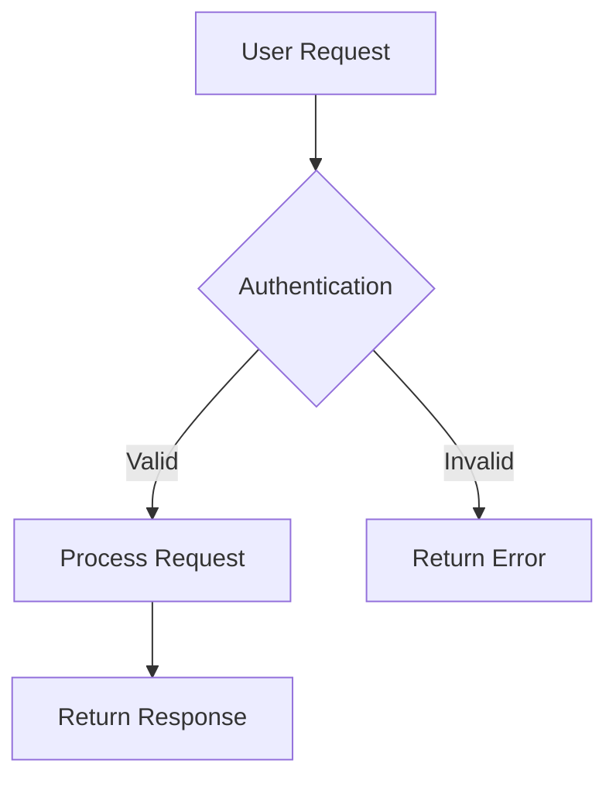

# Image Modal Guide

The @knowcode/doc-builder includes a powerful image modal system that automatically transforms all images in your documentation into clickable, full-screen experiences.

## Overview

When users click on any image in your generated documentation, it opens in a professional modal overlay with:
- Full-screen viewing experience
- Smooth animations and transitions
- Multiple close methods
- Alt text displayed as captions
- Responsive design for all devices
- Dark theme support

## Features

### Automatic Enhancement
- **Zero Configuration**: All content images automatically become clickable
- **Hover Effects**: Images show subtle hover animations to indicate they're interactive
- **Professional Styling**: Rounded corners, shadows, and smooth transitions

### Modal Experience
- **Full-Screen Display**: Images scale to fit the screen while maintaining aspect ratio
- **Professional Overlay**: Dark backdrop with blur effects
- **Caption Support**: Alt text appears as captions below the modal image
- **Responsive Design**: Optimized for desktop, tablet, and mobile devices

### Accessibility
- **Keyboard Navigation**: Press Escape to close the modal
- **Multiple Close Methods**: Click X button, click outside image, or press Escape
- **Alt Text Integration**: Screen readers can access image descriptions
- **Focus Management**: Proper focus handling when modal opens/closes

## How to Use

### Basic Usage

Simply include images in your markdown files as normal:

```markdown


```

### Best Practices for Alt Text

Since alt text becomes the modal caption, write descriptive, meaningful descriptions:

**✅ Good Alt Text:**
```markdown


```

**❌ Poor Alt Text:**
```markdown


```

### Image Organization

Organize your images in dedicated folders for better maintenance:

```
docs/
├── images/
│   ├── screenshots/
│   │   ├── dashboard.png
│   │   └── settings.png
│   └── diagrams/
│       ├── architecture.svg
│       └── workflow.png
└── guides/
    └── setup-guide.md
```

Then reference them in your markdown:
```markdown

```

## Styling and Theming

### CSS Customization

The modal system uses CSS variables that you can customize:

```css
:root {
  /* Modal overlay background */
  --color-bg-overlay: rgba(0, 0, 0, 0.9);
  
  /* Animation timing */
  --duration-normal: 0.3s;
  --easing-out: cubic-bezier(0.16, 1, 0.3, 1);
  
  /* Border radius for modal image */
  --radius-lg: 12px;
}
```

### Dark Theme Support

The modal automatically adapts to dark theme:
- Darker overlay background
- Adjusted close button styling
- Proper contrast for captions

## Technical Implementation

### Automatic Initialization

The modal system initializes automatically when the page loads:

```javascript
// Automatically called on DOM ready
initImageModal();
```

### Event Handling

The system uses efficient event delegation:
- Single event listener on the document
- Dynamically handles all current and future images
- Proper cleanup when modal closes

### Performance Optimizations

- **CSS-First Approach**: Minimal JavaScript for better performance
- **Event Delegation**: Efficient handling of multiple images
- **Smooth Animations**: Hardware-accelerated CSS transitions
- **Memory Management**: Proper event cleanup

## Supported Image Formats

The modal works with all web-compatible image formats:
- **Raster Images**: PNG, JPG, JPEG, GIF, WEBP
- **Vector Images**: SVG
- **Animated Images**: Animated GIFs, WEBP animations

## Mobile Experience

### Touch-Friendly Interface
- **Large Close Button**: Easy to tap on mobile devices
- **Gesture Support**: Tap outside image to close
- **Responsive Sizing**: Images scale appropriately for screen size
- **Optimized Layout**: Adjusted button and caption sizes for mobile

### Performance on Mobile
- **Lightweight Implementation**: Minimal impact on mobile performance
- **Touch Optimizations**: Proper touch event handling
- **Viewport Considerations**: Respects device viewport settings

## Examples

### Documentation Screenshots

```markdown
# Setup Guide

Follow these steps to configure your application:

1. **Access Settings**
   
   

2. **Configure API Keys**
   
   

3. **Save and Deploy**
   
   
```

### Technical Diagrams

```markdown
# System Architecture

Our system follows a microservices architecture:


The authentication flow works as follows:


```

### Before/After Comparisons

```markdown
# UI Improvements

We've redesigned the dashboard for better usability:

**Before:**


**After:**

```

## Troubleshooting

### Images Not Clickable

**Problem**: Images don't show hover effects or modal
**Solution**: Ensure images are within content areas with the `.content` class

### Modal Not Opening

**Problem**: Clicking images doesn't open modal
**Solution**: Check that main.js is properly loaded and no JavaScript errors exist

### Caption Not Showing

**Problem**: Alt text doesn't appear as caption
**Solution**: Verify alt text is present in the markdown image syntax

### Styling Issues

**Problem**: Modal appears broken or unstyled
**Solution**: Ensure notion-style.css is properly loaded

## Advanced Usage

### Custom Image Classes

Add custom classes to images for special styling:

```markdown
{.hero-image}
```

### Image Galleries

Create image galleries with multiple related images:

```markdown
## Product Screenshots


```

## Integration with Other Features

### Mermaid Diagrams

Mermaid diagrams can also benefit from the modal system when exported as images:

```markdown


### PDF Export

When using PDF export features, images maintain their quality and alt text information.

### Search Integration

Alt text content is indexed for search functionality, making images discoverable.

## Best Practices Summary

1. **Write Descriptive Alt Text**: Use meaningful descriptions that work as captions
2. **Organize Images**: Keep images in dedicated folders with logical structure
3. **Optimize File Sizes**: Use appropriate image compression for web delivery
4. **Consider Accessibility**: Ensure alt text provides value for screen readers
5. **Test Responsiveness**: Verify images work well on different device sizes
6. **Use Appropriate Formats**: Choose the right image format for your content type

## Conclusion

The image modal system in @knowcode/doc-builder provides a professional, accessible way to showcase images in your documentation. With zero configuration required, it automatically enhances the user experience while maintaining excellent performance and accessibility standards.

For more advanced customization options or troubleshooting, refer to the main documentation or reach out to the community for support.