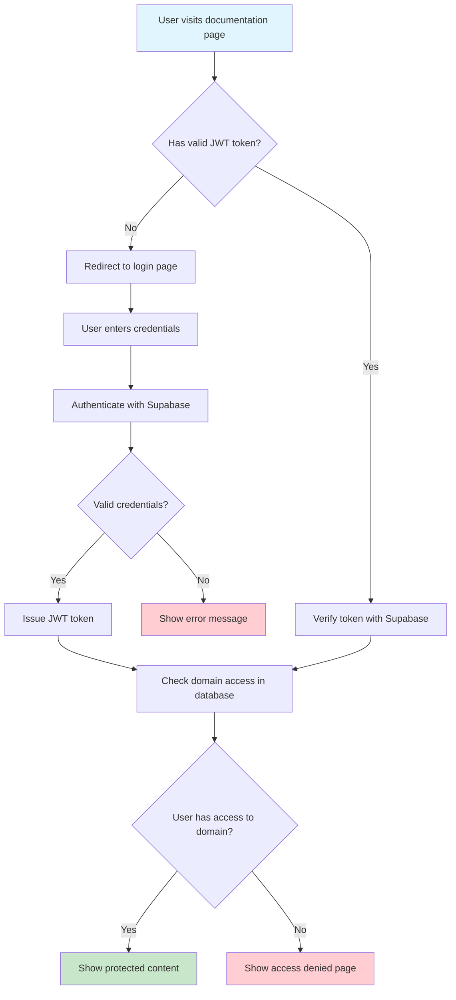

# Complete Supabase Authentication Guide

A comprehensive guide to implementing enterprise-grade authentication in @knowcode/doc-builder using Supabase.

## Table of Contents
- [Overview](#overview)
- [How It Works](#how-it-works)
- [Authentication Modes](#authentication-modes)
- [Quick Setup](#quick-setup)
- [Database Setup](#database-setup)
- [User Management](#user-management)
- [Security Features](#security-features)
- [Configuration Options](#configuration-options)
- [Troubleshooting](#troubleshooting)
- [Advanced Topics](#advanced-topics)

## Overview

@knowcode/doc-builder includes built-in **Supabase authentication** that provides enterprise-grade security with zero configuration. The system uses JWT tokens, domain-based access control, and automatic session management to protect your documentation.

### Why Supabase?

| Feature | Benefit |
|---------|---------|
| 🔐 **Enterprise Security** | JWT tokens, bcrypt password hashing, Row Level Security |
| 👥 **Scalable User Management** | Handles millions of users with fine-grained access control |
| 🌍 **Global Infrastructure** | Built on PostgreSQL with worldwide edge locations |
| 💰 **Generous Free Tier** | 50,000 monthly active users at no cost |
| 🔄 **Real-time Updates** | Live permission changes without restarts |
| 🛡️ **Built-in Security** | Multi-factor auth, OAuth providers, audit logs |

## How It Works

The authentication system follows this flow:



### Technical Architecture

1. **Client-Side Check**: JavaScript checks for valid JWT token on page load
2. **Supabase Verification**: Token verified against Supabase auth service
3. **Domain-Based Access**: User access checked against `docbuilder_access` table
4. **Content Display**: Protected content shown only to authorized users
5. **Session Management**: Automatic token refresh and session persistence

## Authentication Modes

@knowcode/doc-builder supports three authentication modes:

### 1. 🌍 Global Authentication

**When to use**: Entire documentation site requires login

```javascript
// doc-builder.config.js
module.exports = {
  features: {
    authentication: 'supabase'  // Entire site protected
  }
};
```

**Behavior**:
- All pages require authentication
- Redirects to login if not authenticated
- Shows access denied if user lacks domain access

### 2. 📁 Private Directory Authentication

**When to use**: Public docs with some private sections (most common)

```bash
# Create private directory - authentication automatically enabled
mkdir docs/private
echo "# Admin Documentation" > docs/private/admin-guide.md
```

**Behavior**:
- Public pages accessible to everyone
- `/private/` folders require authentication
- Seamless navigation between public and private content

### 3. 🔄 Hybrid Mode

**When to use**: Complex access requirements

```javascript
// doc-builder.config.js
module.exports = {
  features: {
    authentication: 'supabase',      // Global auth enabled
    privateDirectoryAuth: true      // Also check private directories
  }
};
```

**Behavior**:
- Combines global and directory-based authentication
- Granular control over different sections
- Advanced user permission management

## Quick Setup

### Option 1: Zero Configuration (Recommended)

The easiest way to get started - built-in credentials included:

```bash
# 1. Create private content
mkdir docs/private
echo "# Secret Documentation" > docs/private/admin.md

# 2. Deploy with authentication automatically enabled
npx @knowcode/doc-builder deploy

# 3. Add users in Supabase dashboard
# Visit your deployed site - authentication is ready!
```

### Option 2: Custom Configuration

For advanced users who want to use their own Supabase project:

```javascript
// doc-builder.config.js
module.exports = {
  siteName: 'My Secure Docs',
  
  features: {
    authentication: 'supabase'
  },
  
  auth: {
    supabaseUrl: process.env.SUPABASE_URL || 'https://your-project.supabase.co',
    supabaseAnonKey: process.env.SUPABASE_ANON_KEY || 'your-anon-key'
  }
};
```

## Database Setup

### Automatic Setup (Built-in Project)

If you're using the built-in Supabase project (recommended), the database is already configured. Skip to [User Management](#user-management).

### Manual Setup (Custom Project)

If using your own Supabase project, run this SQL in the Supabase SQL editor:

```sql
-- Create access control table
CREATE TABLE docbuilder_access (
    user_id UUID REFERENCES auth.users(id) ON DELETE CASCADE,
    domain TEXT NOT NULL,
    created_at TIMESTAMPTZ DEFAULT NOW(),
    updated_at TIMESTAMPTZ DEFAULT NOW(),
    PRIMARY KEY (user_id, domain)
);

-- Create indexes for performance
CREATE INDEX idx_docbuilder_access_domain ON docbuilder_access(domain);
CREATE INDEX idx_docbuilder_access_user_id ON docbuilder_access(user_id);

-- Enable Row Level Security
ALTER TABLE docbuilder_access ENABLE ROW LEVEL SECURITY;

-- RLS Policy: Users can only see their own access records
CREATE POLICY "Users see own access" ON docbuilder_access
    FOR SELECT USING (user_id = auth.uid());

-- RLS Policy: Service role can manage all access
CREATE POLICY "Service role manages access" ON docbuilder_access
    FOR ALL USING (current_setting('role') = 'service_role');

-- Create trigger to update timestamp
CREATE OR REPLACE FUNCTION update_updated_at_column()
RETURNS TRIGGER AS $$
BEGIN
    NEW.updated_at = NOW();
    RETURN NEW;
END;
$$ language 'plpgsql';

CREATE TRIGGER update_docbuilder_access_updated_at 
    BEFORE UPDATE ON docbuilder_access
    FOR EACH ROW EXECUTE FUNCTION update_updated_at_column();
```

### Database Schema

The authentication system uses a simple schema:

```sql
-- Table: docbuilder_access
-- Purpose: Controls which users can access which documentation domains

Column        Type         Description
-----------   -----------  ----------------------------------
user_id       UUID         Reference to auth.users(id)
domain        TEXT         Domain name (e.g., docs.example.com)
created_at    TIMESTAMPTZ  When access was granted
updated_at    TIMESTAMPTZ  Last modified timestamp
```

## User Management

### Creating Users

**Option 1: Supabase Dashboard**
1. Visit your Supabase project dashboard
2. Go to Authentication → Users
3. Click "Invite user"
4. Enter email address
5. User receives signup email

**Option 2: User Self-Registration**
Users can sign up at your login page if enabled in Supabase settings.

### Granting Access

Grant a user access to your documentation domain:

```sql
-- Grant access to a single user
INSERT INTO docbuilder_access (user_id, domain)
VALUES (
    (SELECT id FROM auth.users WHERE email = 'user@example.com'),
    'docs.example.com'
);

-- Grant access to multiple users
INSERT INTO docbuilder_access (user_id, domain)
SELECT id, 'docs.example.com' 
FROM auth.users 
WHERE email IN (
    'admin@example.com',
    'developer@example.com',
    'manager@example.com'
);

-- Grant access to all existing users (be careful!)
INSERT INTO docbuilder_access (user_id, domain)
SELECT id, 'docs.example.com' FROM auth.users;
```

### Revoking Access

Remove a user's access to your documentation:

```sql
-- Remove specific user access
DELETE FROM docbuilder_access 
WHERE user_id = (SELECT id FROM auth.users WHERE email = 'user@example.com')
  AND domain = 'docs.example.com';

-- Remove all access for a domain (nuclear option)
DELETE FROM docbuilder_access WHERE domain = 'docs.example.com';
```

### Bulk User Management

**Add users from CSV:**
```sql
-- Create temporary table
CREATE TEMP TABLE user_emails (email TEXT);

-- Insert emails (replace with your list)
INSERT INTO user_emails VALUES 
('user1@example.com'),
('user2@example.com'),
('user3@example.com');

-- Grant access to all
INSERT INTO docbuilder_access (user_id, domain)
SELECT u.id, 'docs.example.com'
FROM auth.users u
JOIN user_emails e ON u.email = e.email;
```

**View all users with access:**
```sql
SELECT 
    u.email,
    u.created_at as user_created,
    da.created_at as access_granted,
    da.domain
FROM auth.users u
JOIN docbuilder_access da ON u.id = da.user_id
WHERE da.domain = 'docs.example.com'
ORDER BY da.created_at DESC;
```

## Security Features

### What's Included

| Security Feature | Implementation | Benefit |
|------------------|----------------|---------|
| **JWT Authentication** | Industry-standard tokens | Stateless, secure authentication |
| **Password Hashing** | bcrypt with salt | Passwords never stored in plaintext |
| **Row Level Security** | PostgreSQL RLS policies | Database-level access control |
| **Session Management** | Automatic token refresh | Seamless user experience |
| **HTTPS Only** | Enforced in production | Encrypted data transmission |
| **Domain Validation** | Runtime domain checking | Prevents unauthorized access |
| **Content Protection** | Client-side verification | No content served to unauthorized users |

### Security Best Practices

1. **Use Environment Variables** (for custom projects):
   ```bash
   # .env.local
   SUPABASE_URL=https://your-project.supabase.co
   SUPABASE_ANON_KEY=your-anon-key
   ```

2. **Regular Access Audits**:
   ```sql
   -- Review user access monthly
   SELECT u.email, da.domain, da.created_at
   FROM auth.users u
   JOIN docbuilder_access da ON u.id = da.user_id
   ORDER BY da.created_at DESC;
   ```

3. **Monitor Authentication Logs**:
   - Check Supabase dashboard for login attempts
   - Review failed authentication events
   - Set up alerts for suspicious activity

4. **Custom Domain Setup**:
   ```bash
   # Use professional domains for better security
   https://docs.yourcompany.com  # Good
   https://random-string.vercel.app  # Less secure
   ```

## Configuration Options

### Basic Configuration

```javascript
// doc-builder.config.js - Minimal setup
module.exports = {
  features: {
    authentication: 'supabase'  // Enable authentication
  }
};
```

### Advanced Configuration

```javascript
// doc-builder.config.js - Full configuration
module.exports = {
  siteName: 'Secure Documentation',
  siteDescription: 'Private company documentation',
  
  features: {
    authentication: 'supabase',         // Enable Supabase auth
    privateDirectoryAuth: true,        // Also protect /private/ directories
    mermaid: true,                     // Enable diagrams
    tooltips: true,                    // Enable tooltips
    phosphorIcons: true               // Use Phosphor icons
  },
  
  auth: {
    // Optional: Use custom Supabase project
    supabaseUrl: process.env.SUPABASE_URL,
    supabaseAnonKey: process.env.SUPABASE_ANON_KEY,
    
    // Optional: Custom login page settings
    loginPageTitle: 'Access Documentation',
    loginPageSubtitle: 'Enter your credentials to continue'
  },
  
  // SEO settings work with authentication
  seo: {
    author: 'Your Company',
    keywords: ['documentation', 'secure', 'private'],
    ogImage: '/images/og-secure.png'
  }
};
```

### Environment Variables

```bash
# .env.local - For custom Supabase projects
SUPABASE_URL=https://your-project.supabase.co
SUPABASE_ANON_KEY=eyJhbGciOiJIUzI1NiIsInR5cCI6IkpXVCI...

# Optional: Custom domain for authentication
AUTH_DOMAIN=docs.yourcompany.com
```

## Troubleshooting

### Common Issues

#### 🔍 **Users can't log in**

**Symptoms**: Login form shows errors, authentication fails

**Solutions**:
1. Check Supabase project is active and accessible
2. Verify credentials in config file
3. Ensure user exists in `auth.users` table
4. Check user's email is confirmed (if confirmation required)

```sql
-- Check if user exists
SELECT email, email_confirmed_at FROM auth.users WHERE email = 'user@example.com';

-- Check user access
SELECT * FROM docbuilder_access 
WHERE user_id = (SELECT id FROM auth.users WHERE email = 'user@example.com');
```

#### 🔄 **Content flashes before redirect**

**Symptoms**: Protected content briefly visible before login redirect

**Solutions**:
1. Update to latest version (`npm install @knowcode/doc-builder@latest`)
2. Check network speed - slow connections may see flashing
3. Verify authentication script is loading properly

```html
<!-- This CSS is automatically included to prevent flashing -->
<style>
  body { visibility: hidden; opacity: 0; }
  body.authenticated { visibility: visible; opacity: 1; }
</style>
```

#### ❌ **Access denied after login**

**Symptoms**: User logs in successfully but sees "Access Denied" page

**Solutions**:
1. Check user has entry in `docbuilder_access` table
2. Verify domain matches exactly (including subdomains)
3. Check RLS policies are correctly configured

```sql
-- Debug access check
SELECT 
    u.email,
    da.domain,
    'Expected: ' || 'your-actual-domain.com' as expected_domain
FROM auth.users u
LEFT JOIN docbuilder_access da ON u.id = da.user_id
WHERE u.email = 'user@example.com';
```

#### 🔌 **Authentication not working locally**

**Symptoms**: Authentication works on deployment but not locally

**Solutions**:
1. Check localhost is included in Supabase allowed origins
2. Use `http://localhost:3000` exactly in Supabase settings
3. Clear browser cache and cookies

### Debug Checklist

When authentication isn't working:

- [ ] Check browser console for JavaScript errors
- [ ] Verify JWT token in DevTools → Application → Local Storage
- [ ] Test Supabase connection in browser network tab
- [ ] Confirm domain in database matches deployment URL
- [ ] Check Supabase project is active and not paused
- [ ] Verify user email is confirmed (if required)
- [ ] Test with a fresh incognito browser window

### Getting Help

1. **Check the logs**: Browser console and Supabase dashboard
2. **Test components**: Try logging in directly to Supabase dashboard
3. **Verify setup**: Run through setup steps again
4. **Ask for help**: Open an issue on GitHub with full error details

## Advanced Topics

### Custom Authentication Pages

While @knowcode/doc-builder generates beautiful login pages automatically, you can customize them:

```javascript
// doc-builder.config.js
module.exports = {
  auth: {
    // Custom login page configuration
    loginPageTitle: 'Secure Access Required',
    loginPageSubtitle: 'Please authenticate to view our documentation',
    
    // Custom styling (advanced)
    customLoginCSS: `
      .auth-box { 
        border-radius: 12px; 
        box-shadow: 0 8px 32px rgba(0,0,0,0.1);
      }
    `
  }
};
```

### Multi-Domain Setup

For organizations with multiple documentation sites:

```sql
-- Grant user access to multiple domains
INSERT INTO docbuilder_access (user_id, domain) VALUES
((SELECT id FROM auth.users WHERE email = 'admin@example.com'), 'docs.example.com'),
((SELECT id FROM auth.users WHERE email = 'admin@example.com'), 'api.example.com'),
((SELECT id FROM auth.users WHERE email = 'admin@example.com'), 'internal.example.com');

-- View user's access across all domains
SELECT u.email, array_agg(da.domain) as accessible_domains
FROM auth.users u
JOIN docbuilder_access da ON u.id = da.user_id
GROUP BY u.id, u.email;
```

### OAuth Integration

Enable social login through Supabase (optional):

1. **In Supabase Dashboard**:
   - Go to Authentication → Settings
   - Enable desired providers (Google, GitHub, etc.)
   - Configure OAuth credentials

2. **Update your config**:
```javascript
// doc-builder.config.js
module.exports = {
  auth: {
    enableOAuth: true,
    oauthProviders: ['google', 'github']
  }
};
```

### Role-Based Access Control

Implement different permission levels:

```sql
-- Add role column to access table
ALTER TABLE docbuilder_access ADD COLUMN role TEXT DEFAULT 'reader';

-- Grant different roles
INSERT INTO docbuilder_access (user_id, domain, role) VALUES
((SELECT id FROM auth.users WHERE email = 'admin@example.com'), 'docs.example.com', 'admin'),
((SELECT id FROM auth.users WHERE email = 'editor@example.com'), 'docs.example.com', 'editor'),
((SELECT id FROM auth.users WHERE email = 'reader@example.com'), 'docs.example.com', 'reader');
```

### API Access Control

Protect API documentation or interactive content:

```javascript
// In your custom HTML pages
<script>
async function checkAuthForAPI() {
    const { data: { user } } = await supabaseClient.auth.getUser();
    if (!user) {
        // Redirect to login or show error
        return false;
    }
    return true;
}

// Use in interactive demos
if (await checkAuthForAPI()) {
    // Show API explorer or interactive content
}
</script>
```

## Conclusion

Supabase authentication in @knowcode/doc-builder provides enterprise-grade security with minimal setup. The system handles everything from user management to session persistence, letting you focus on creating great documentation.

**Key takeaways**:
- 🚀 **Zero configuration** required with built-in credentials
- 🌐 **Domain-based access** control eliminates complex site registration
- 📁 **Private directory** support for hybrid public/private docs
- 🔒 **Enterprise security** with JWT tokens and Row Level Security
- 👥 **Scalable user management** supporting unlimited users

For most use cases, simply creating a `/private/` directory and running `npx @knowcode/doc-builder deploy` is all you need to secure your documentation.

Need help? Check the [troubleshooting section](#troubleshooting) or open an issue on GitHub.