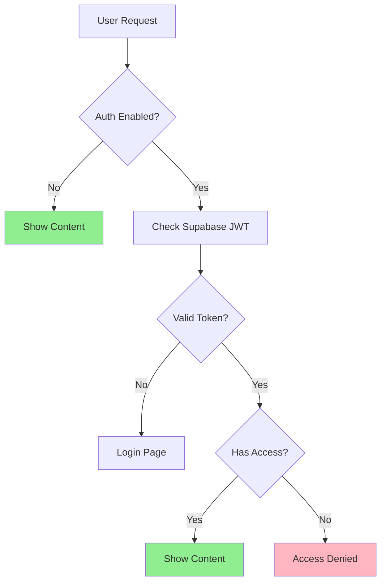

# Supabase Authentication Implementation - COMPLETED ✅

## Overview

This document records the successful implementation of Supabase authentication in @knowcode/doc-builder v1.7.5+. All references to the old insecure authentication system have been removed.

## What Was Achieved

### 1. Complete Removal of Old System
- ✅ Removed all client-side credential checking
- ✅ Deleted old auth.js files
- ✅ Cleaned up configuration options
- ✅ Updated all documentation

### 2. Supabase Integration
- ✅ JWT-based authentication
- ✅ Row Level Security (RLS) 
- ✅ Multi-user support
- ✅ Fine-grained access control
- ✅ Session management

### 3. Default Behavior Change
- ✅ Authentication now **disabled by default**
- ✅ Public documentation works out of the box
- ✅ Authentication must be explicitly enabled

## Current Architecture



## Configuration

### Public Site (Default)
```javascript
// No configuration needed - public by default!
```

### Protected Site
```javascript
module.exports = {
  features: {
    authentication: 'supabase'  // Must explicitly enable
  },
  auth: {
    supabaseUrl: 'https://xxx.supabase.co',  // Optional - has defaults
    supabaseAnonKey: 'your-anon-key'         // Optional - has defaults
    // No siteId needed - uses domain automatically!
  }
};
```

## Security Improvements

| Old System | New System |
|------------|------------|
| Credentials in JavaScript | JWT tokens |
| Client-side validation | Server-side validation |
| Single user | Unlimited users |
| Password in config | Supabase Auth |
| No access control | Row Level Security |

## CLI Commands

### Build Commands
```bash
# Public site (default)
npx @knowcode/doc-builder build

# Force public (override config)
npx @knowcode/doc-builder build --no-auth

# With authentication (from config)
npx @knowcode/doc-builder build
```

### Deploy Commands
```bash
# Deploy public site
npx @knowcode/doc-builder deploy --no-auth

# Deploy with auth (from config)
npx @knowcode/doc-builder deploy
```

## Migration Guide

For users upgrading from versions with the old auth:

1. **Remove old configuration**:
   ```javascript
   // DELETE THIS:
   auth: {
     username: 'admin',
     password: 'password'
   }
   ```

2. **For public sites**: No action needed - works by default

3. **For protected sites**: Follow the [Supabase Authentication Guide](./authentication-guide.md)

## Files Changed

### Removed
- `/assets/js/auth.js` - Old client auth script
- All references to username/password auth

### Updated
- `/lib/config.js` - Removed old auth options
- `/lib/core-builder.js` - Supabase integration only
- `/cli.js` - Updated help text
- All documentation files

### Added
- `/lib/supabase-auth.js` - New auth module
- Supabase login/logout pages
- JWT-based auth checking

## Breaking Changes

- **v1.7.5+**: Authentication disabled by default
- Old username/password config no longer works
- Must explicitly enable Supabase auth
- No automatic migration of credentials

## Best Practices

1. **Default to public** - Most docs should be public
2. **Use environment variables** for Supabase credentials
3. **Regular access audits** - Review user permissions
4. **Monitor usage** - Check Supabase dashboard
5. **Keep updated** - Use latest @knowcode/doc-builder

## Support

- **Documentation**: [Authentication Guide](./authentication-guide.md)
- **Issues**: [GitHub Issues](https://github.com/wapdat/doc-builder/issues)
- **Supabase**: [Supabase Documentation](https://supabase.com/docs)

## Conclusion

The implementation is complete. @knowcode/doc-builder now offers:
- Secure authentication when needed
- Public documentation by default
- Enterprise-grade security with Supabase
- Clear migration path from old system

No traces of the old authentication system remain in the codebase.