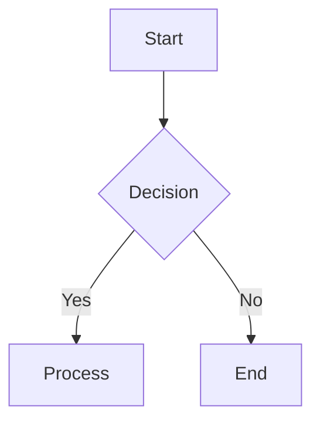

# Markdown Document Standards Prompt

Use this prompt when creating or updating documentation for doc-builder projects to ensure consistency and quality.

## Prompt

Please follow these markdown documentation standards when creating or editing documents:

### 1. Document Structure

**Required Elements:**
- Start with a clear H1 title (`# Document Title`)
- Include a brief overview paragraph immediately after the title
- Use hierarchical heading structure (H2 for main sections, H3 for subsections)
- End with a summary or conclusion when appropriate

**Example Structure:**
```markdown
# Feature Guide Title

Brief overview explaining what this document covers and why it's important.

## Overview
Detailed introduction to the topic...

## Main Section
### Subsection
Content...

## Conclusion
Summary of key points...
```

### 2. File Naming Conventions

- Use lowercase with hyphens: `feature-name-guide.md`
- Be descriptive but concise: `authentication-setup.md` not `auth.md`
- Use standard suffixes:
  - `-guide.md` for how-to guides
  - `-reference.md` for API/technical references
  - `-overview.md` for conceptual explanations
  - `-troubleshooting.md` for problem-solving docs

### 3. Image Guidelines

**When including images:**
- Always use meaningful alt text that describes the image content
- Store images in an `images/` or `assets/` subdirectory
- Use descriptive filenames: `authentication-flow-diagram.png` not `img1.png`

**Image Markdown Format:**
```markdown

```

**Good Alt Text Examples:**
- ✅ ``
- ✅ ``
- ❌ ``
- ❌ ``

### 4. Code Examples

**Code Block Requirements:**
- Always specify the language for syntax highlighting
- Include comments for complex code
- Show both correct and incorrect usage when relevant
- Keep examples concise and focused

```javascript
// Good example with language specified
const config = {
  siteName: 'My Documentation',
  features: {
    authentication: true
  }
};
```

### 5. Special Folders and Files

**Navigation Control:**
- Files/folders starting with `_` are excluded from navigation
- Use for drafts: `_draft-feature.md`
- Use for internal notes: `_internal/planning.md`

**Special Files:**
- `README.md` in any folder becomes the folder's overview page
- `index.md` takes priority over `README.md` for the main page

### 6. Content Guidelines

**Writing Style:**
- Use clear, concise language
- Write in active voice
- Use present tense for instructions
- Include examples whenever possible

**Lists and Tables:**
- Use bullet points for unordered information
- Use numbered lists for sequential steps
- Include tables for comparing options or listing parameters

**Links:**
- Use descriptive link text: `[See the authentication guide](auth-guide.md)`
- Never use "click here" or bare URLs
- Prefer relative links for internal documentation

### 7. Front Matter (Optional)

For SEO and page customization:
```yaml
---
title: Custom Page Title
description: Brief description for SEO
keywords: authentication, setup, configuration
---
```

### 8. Accessibility

- Use proper heading hierarchy (don't skip levels)
- Include alt text for all images
- Use descriptive link text
- Ensure code examples are screen-reader friendly

### 9. Mermaid Diagrams

When using Mermaid diagrams:
```markdown


### 10. Version References

When mentioning version-specific features:
- Always specify the version: "Available in v1.8.5+"
- Link to changelog when discussing changes
- Use semantic versioning consistently

Remember: These standards ensure documentation is consistent, accessible, and easy to maintain. When in doubt, prioritize clarity and user experience.